# SwapBased V2 Core 学习指南

本文档面向希望**系统理解本仓库**、并达到**面试可深入讲解**水平的读者。阅读顺序建议：先通读本指南，再对照源码与 `[INTERVIEW_PREP.md](INTERVIEW_PREP.md)` 中的问题自测。

---

## 1. 项目一句话

本仓库是 **DEX（Uniswap V2 系 AMM）+ 流动性挖矿（MasterChef + StakingRewards）+ 若干衍生代币与单币质押池** 的 Solidity 源码集合，奖励通过 **可铸造代币（`IBaseToken.mint`）** 发放，MasterChef 作为 **唯一可信的「铸币网关」** 按池配置拆分多币种奖励。

---

## 2. 整体架构

### 2.1 分层视图

| 层级      | 作用                                              | 本仓库主要合约                                                                |
| ------- | ----------------------------------------------- | ---------------------------------------------------------------------- |
| 交易与流动性  | 恒定乘积做市、LP Token、路由.swap                         | `UniswapV2Factory` / `UniswapV2Pair` / `UniswapV2Router02`             |
| 挖矿与治理权重 | 注册 Farm、全局每秒产出、池子权重、社区投票加成、按池铸造奖励               | `MasterchefV2` 或 `MasterChefCoin`                                      |
| 单池质押    | 用户质押 LP 或其它 ERC20，累积「应得奖励」，领取时向 MasterChef 申请铸币 | `masterchefv2/StakingRewards.sol`、`vaultsv2/SingleStakingRewards*.sol` |
| 衍生代币    | xBASE、oCOIN 等：锁仓、归属、即时退出等，部分路径同样走 `mintRewards` | `vaultsv2/xBASE.sol`、`vaultsv2/oCOIN.sol`                              |

### 2.2 数据流（核心）

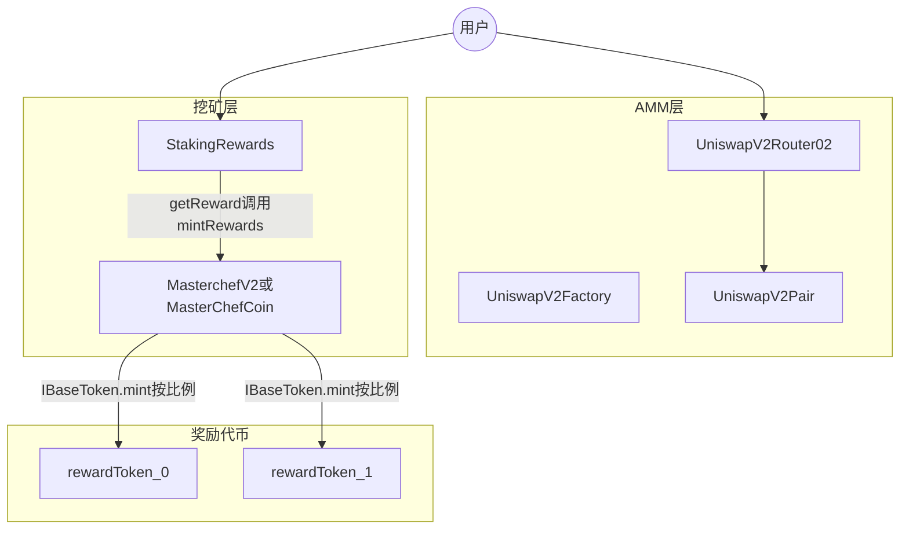

**关键设计**：`StakingRewards` 合约内**不必预先存放**全部奖励代币余额；用户应得金额用 `rewardPerToken` / `earned` 累计，领取时把「记账金额」交给 MasterChef，由 MasterChef 按该池的 `rewards[]` 与 `ratios[]`（万分比）调用多个代币的 `mint`。

---

## 3. 设计思路（为什么这样拆）

### 3.1 为何用 MasterChef 做铸币网关？

- **权限收敛**：只有 `isFarm[msg.sender]` 的合约能调用 `mintRewards`，避免任意合约伪造奖励。
- **多奖励代币**：一个池可配置多个 `IBaseToken`，`mintRewards` 内按 `ratios[i] / 10000` 拆分（见 `[masterchefv2/MasterchefV2.sol](masterchefv2/MasterchefV2.sol)`）。
- **与 Synthetix 式 StakingRewards 解耦**：Farm 只负责「分蛋糕」与记账；铸币策略与代币经济在代币合约侧实现。

### 3.2 StakingRewards 的奖励模型（直觉）

- 把每秒释放的奖励 `rewardRate` 均摊到**当前质押总量**上，得到「每单位质押每秒累积的奖励」，再积分得到 `rewardPerToken`。
- 用户维度用 `userRewardPerTokenPaid` 与 `rewards` 记录「已结算部分」与「待领取余额」，典型 **Synthetix StakingRewards** 写法。
- 领取时 `getReward()` 先清零本地 `rewards[msg.sender]`，再调用 `IMasterChef(masterChef).mintRewards(msg.sender, reward)`；另对 `taxWallet` 铸 **2%** `ownerFee`（见 `[masterchefv2/StakingRewards.sol](masterchefv2/StakingRewards.sol)`）。

### 3.3 MasterChef 中的「池子控制」与「投票」

- `**masterchefControlled`**：为 true 时，Owner 通过 `_updatePool` 根据全局 `globalSkullPerSecond`、`allocPoint` 等**同步**该池 `StakingRewards.rewardRate`。
- `**isVoteable` 与 `allocPointCommunity`**：可投票池在基础分配之外，再叠加社区分配；用户通过 `votePool` / `unVotePool` 使用 `xBASE` 余额（及可选的单币质押余额）作为投票权，调整各池 `allocPointCommunity`。内部在 `increaseAllocation` / `decreaseAllocation` 中，若距离上次更新超过 **7 天** 会触发 `_massUpdatePools`，再更新 `lastUpdatedTimeVotes`。

### 3.4 `MasterchefV2` 与 `MasterChefCoin` 的差异

两者主体逻辑一致。`**MasterChefCoin`** 额外包含：

- `mapping(address => bool) public minters` 与 `onlyRewardsMinter`；
- `mintRewardsByAddress(receiver, amount, token)`：由白名单地址直接对**指定代币** `mint`，不经过 Farm 的 `ratios` 拆分。

部署时 `MasterChefCoin` 构造函数会把 `minters[msg.sender]` 设为 true（部署者）。

---

## 4. 核心用户流程（端到端）

1. **交易 / 加池**：用户通过 `UniswapV2Router02` 与 `UniswapV2Pair` 交互（swap、addLiquidity），获得 LP Token（Pair 合约的 ERC20）。
2. **质押**：用户向已部署的 `StakingRewards` `approve` 后 `stake`；可能扣 **1%** `depositFee` 到 `taxWallet`。
3. **累积奖励**：`rewardPerToken()` 随时间增长；`earned(user)` 为待领取数量。
4. **领取**：`getReward()` → `MasterChef.mintRewards` → 各奖励代币 `mint` 到用户（及税费地址）。
5. **投票（可选）**：持有 `xBASE`（及可选质押）的用户 `votePool(pid)`，影响社区奖励分配；`mintRewards` 前会 `updateVotePool` 同步投票权变化。

---

## 5. Uniswap V2 核心（本仓库片段）

- **恒定乘积**：`reserve0 * reserve1` 在单笔 swap 后不减（扣除手续费后仍满足池子规则）；`swap` 前会更新累计价格用于 TWAP（`[UniswapV2Pair.sol](UniswapV2Pair.sol)`）。
- **手续费与协议费**：标准 V2 逻辑，`feeOn` 时可能向 `feeTo` 铸造流动性（`_mintFee`）。
- **Router**：封装 `addLiquidity` / `swapExactTokensForTokens` 等，处理比例、最小输出、deadline。

---

## 6. Vaults v2 要点

- `**xBASE`**：包装 BASE 类代币，带归属（vesting）等；与 `IMasterChef` 集成用于奖励结算（见 `[vaultsv2/xBASE.sol](vaultsv2/xBASE.sol)`）。
- `**oCOIN**`：与 `coinToken`、WETH、可选 V2/V3 价格源结合；支持 `lock`/`vest`/`instantExit`/`claim` 等；部分出口调用 `IMasterChef(masterChef).mintRewards`（见 `[vaultsv2/oCOIN.sol](vaultsv2/oCOIN.sol)`）。
- `**SingleStakingRewardsBase` / `XBase` / `OtherTokens**`：与 `masterchefv2/StakingRewards` 同思路的单币质押变体，用于不同质押资产或奖励路径。

更细的架构、流程与文件说明见 **第 12 节**。

---

## 7. CoinToken（COIN）

[`CoinToken.sol`](CoinToken.sol) 实现协议内 **COIN** 代币：在 OpenZeppelin 风格 **ERC20 + ERC20Burnable** 基础上，增加 **`minters` 白名单铸造**、**Operator 角色**（救币与维护铸造者）、以及对 **`burnFrom` / `transferFrom` 的显式覆盖**。COIN 通常作为 **流动性挖矿、质押或衍生品（如 oCOIN）路径中的奖励/计价代币**，由经治理接入的合约按经济模型 `mint` 给用户或池子。

### 7.1 业务场景与实例

| 场景 | 说明 |
|------|------|
| **Farm 奖励** | `MasterChefCoin` 等将本合约地址配置为奖励代币之一，并把 Chef 合约（或路由合约）加入 `minters`；用户 `getReward` 时由 Chef 调用 `coinToken.mint(user, amount)` 发放 COIN。 |
| **用户主动销毁** | 用户持有 COIN 后可调用 `burn`，减少流通量（通缩或游戏化销毁）。 |
| **oCOIN 等衍生品** | 如 [`vaultsv2/oCOIN.sol`](vaultsv2/oCOIN.sol) 中用户锁仓/操作会 `IERC20(coinToken).transferFrom` 或 `burn`，COIN 与包装代币形成闭环。 |
| **误转救回** | 用户若向 `CoinToken` 合约地址误转 **其它 ERC20**，Operator 可调用 `governanceRecoverUnsupported` 将误转代币转回指定多签或用户地址（**不**用于随意划走用户正常业务中的 COIN）。 |

**简例**：团队在 Base 上部署 `CoinToken`，部署者成为首个 `minter`；随后 Operator 执行 `setMinters(masterChefAddress, true)`，使 Farm 仅在奖励结算时增发 COIN。用户将 COIN 与 ETH 在 AMM 加池做 LP，再将 LP 质押到 `StakingRewards`，领取时收到 COIN 奖励并可在前端选择部分 `burn` 或参与 oCOIN 锁仓。

### 7.2 架构图（角色与权限）

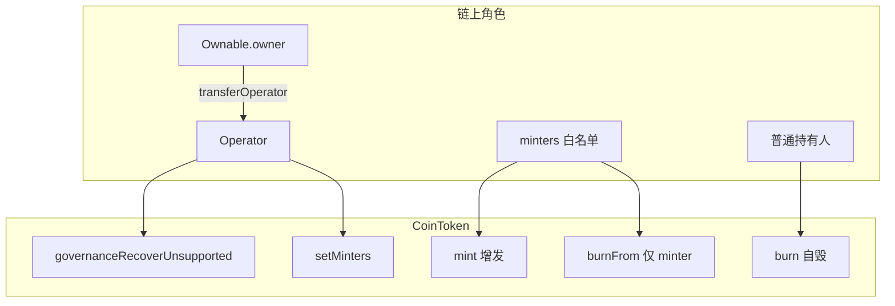

### 7.3 交互流程图

**铸造（典型奖励发放）**

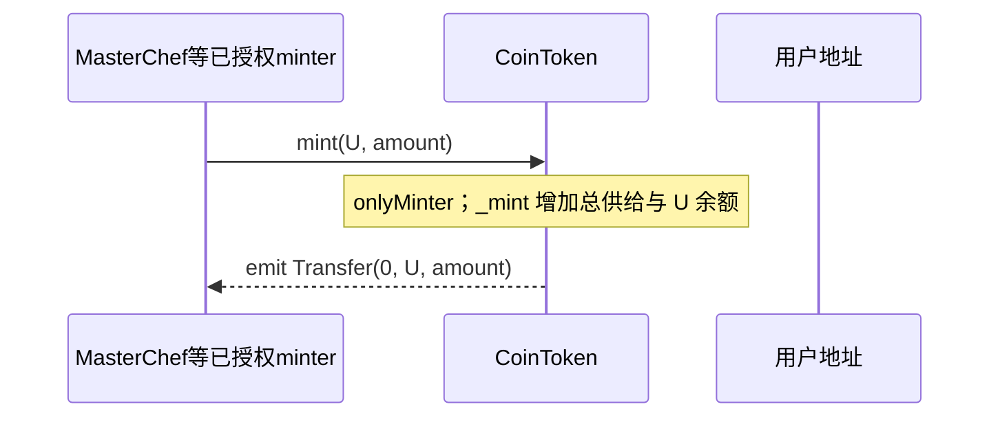

**Operator 维护铸造者与救币**

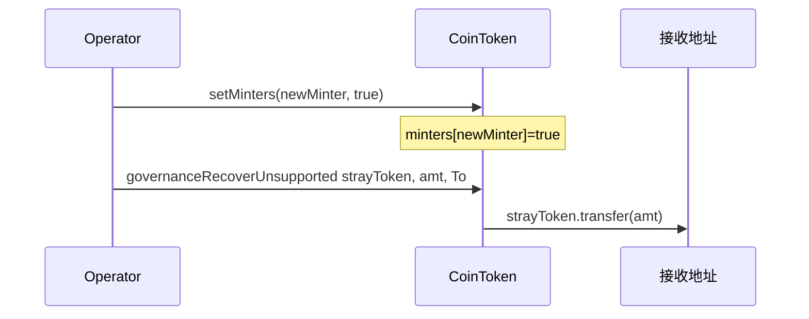

### 7.4 实现与使用注意

- **`burnFrom` 权限**：本合约将 `burnFrom` 限制为 **onlyMinter**，与标准 ERC20Burnable「任意 spender 在 allowance 内可销毁」不同，用于降低任意合约经授权销毁他人 COIN 的风险；普通用户销毁自有代币请用 **`burn`**。
- **`transferFrom`**：显式重写，逻辑与父类一致（先转账再扣 allowance），便于在继承链中固定行为。
- **Operator 信任假设**：`governanceRecoverUnsupported` 可转走本合约持有的任意 IERC20，需链下治理与多签约束 Operator。
- **与 Chef 的配合**：实际部署时需将负责 `mintRewards` 的合约加入 `minters`，否则奖励交易会在 `mint` 处 revert。

更细的 NatSpec 与参数说明见 [`CoinToken.sol`](CoinToken.sol) 内注释。

---

## 8. BaseToken（BASE）

[`BaseToken.sol`](BaseToken.sol) 实现 **BASE** 代币：继承 `ERC20Burnable` 与 `Operator`，**部署时一次性向部署者 mint 100 万枚 BASE**，后续 **`mint` 仅 `onlyOperator`**（无 `minters` 白名单）。BASE 常见用途包括 **底池资产、锁仓费（[`BaseTokenLocker`](BaseTokenLocker.sol)）、协议计价**；**COIN**（第 7 节）更适合 **多合约同时增发奖励**。

### 8.1 BASE 业务场景与实例

| 场景 | 说明 |
|------|------|
| **初始流动性** | 部署者持有 1,000,000 BASE，用于添加 BASE/ETH 或分发给合作方做市。 |
| **锁仓费** | `BaseTokenLocker` 的 `BaseToken` 常指向本合约，用户锁 LP 时支付 `lockFee` 的 BASE。 |
| **Operator 增发** | 治理将 `Operator` 设为运维地址，按路线图 `mint` 至金库或激励池（链下需约束用途）。 |

**简例**：部署完成后部署者获得 1e6 * 1e18 wei BASE；之后仅 Operator 可调 `mint(recipient, amount)`；用户可 `burn` 销毁自有 BASE。

### 8.2 架构图（BASE 与 COIN 对照）

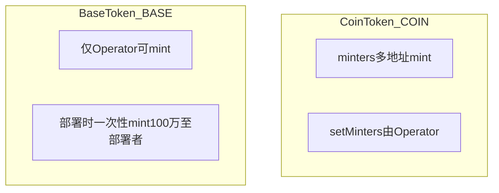

### 8.3 交互流程图（Operator 增发）

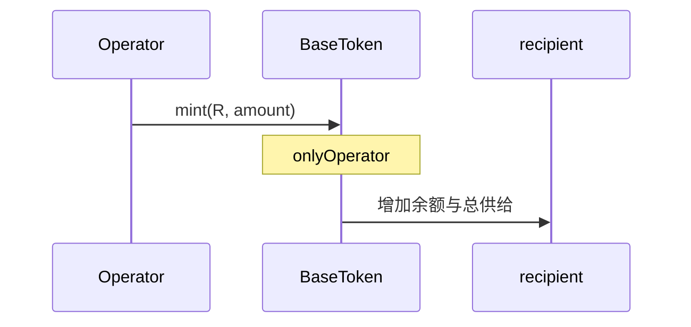

### 8.4 实现与使用注意

- **无 `minters`**：增发权集中在 Operator；若要让某合约直接 `mint` BASE，需将该合约设为 Operator 或由 Operator 预铸再转入（依部署策略而定）。
- **`rewardPoolDistributed`**：预留状态位，具体是否使用由外围脚本决定。
- **与 COIN 分工**：多 Farm、多入口同时 `mint` 更适合 **CoinToken**；单角色控通胀、初始大额分配更适合 **BaseToken**。

更细注释见 [`BaseToken.sol`](BaseToken.sol)。

---

## 9. Chef 控权铸币 + 单池质押分奖 + 部署 Farm

本仓库在 [`masterchefv2/`](masterchefv2/) 下实现 **Synthetix 式单池质押（`StakingRewards`）** 与 **MasterChef 铸币网关** 的组合：Farm 合约**不预存**全部奖励代币，只在用户 `getReward` 时把累计的「奖励计量」交给 Chef，由 Chef **`mintRewards` → 各奖励代币 `IBaseToken.mint`**。**仅 `isFarm` 注册的地址**可调用 `mintRewards`，从而把增发权限从任意 ERC20 收束到已审计的 Farm。

涉及主文件：**[`MasterchefV2.sol`](masterchefv2/MasterchefV2.sol)**（多币 `ratios` + xBASE 投票）、**[`MasterChefCoin.sol`](masterchefv2/MasterChefCoin.sol)**（同上 + `mintRewardsByAddress` / `minters`）、**[`StakingRewards.sol`](masterchefv2/StakingRewards.sol)**（`rewardPerToken` / `earned` / `getReward`）、**[`StakingRewardsFactory.sol`](masterchefv2/StakingRewardsFactory.sol)**（单币奖励的简化 Chef）。**[`Lottery.sol`](masterchefv2/Lottery.sol)** 为独立抽奖逻辑，与 Chef 无直接铸币耦合。

### 9.1 业务场景与实例

| 场景 | 说明 |
|------|------|
| **部署 Farm** | Owner 调用 **`deployWithCreation(stakingToken, farmStartTime)`** 内联 `new StakingRewards`，或先外部部署 StakingRewards 再 **`deploy(farmAddress, startTime, masterchefControlled)`** 注册；`stakingRewardsGenesis` 之前不可 `mintRewards`。 |
| **多币奖励** | `MasterchefV2` / `MasterChefCoin` 每池配置 `rewards[]` 与 `ratios[]`（**万分比**）；`mintRewards` 内 `_amount * ratios[i] / 10000` 分别 `mint` 至 COIN、BASE 等。 |
| **权重与每秒产出** | Owner 设 `globalSkullPerSecond`、`set(pid, allocPoint)`；若 `masterchefControlled`，`_updatePool` 按权重把全局速率写成该池 `StakingRewards.setRewardRate`。 |
| **社区投票加成** | 用户持有 xBASE（及可选单币质押计票）`votePool(pid)`，增加该池 `allocPointCommunity`，与 `globalCommunitySkullPerSecond` 叠加到 `rewardRate`（至少隔 7 天可触发全量 `_massUpdatePools`）。 |
| **简化工厂** | `StakingRewardsFactory` 仅向单一 `rewardsToken` `mint`，适合单一代币激励的早期或侧链部署。 |

**简例**：团队在 Base 部署 `MasterchefV2`，构造函数传入 `[COIN, BASE]` 与 `[5000, 5000]`（万分比各 50%）。Owner `deployWithCreation(BASE_ETH_LP, start)` 生成 Farm A；用户向 Farm A `stake(LP)`，一段时间后 `getReward()`：Farm 调用 `mintRewards(user, R)`，Chef 向用户铸 `R*50%` 的 COIN 与 `R*50%` 的 BASE，并另对用户奖励的 2% 再铸给 `taxWallet`（见 `StakingRewards` 中 `ownerFee`）。

### 9.2 架构图

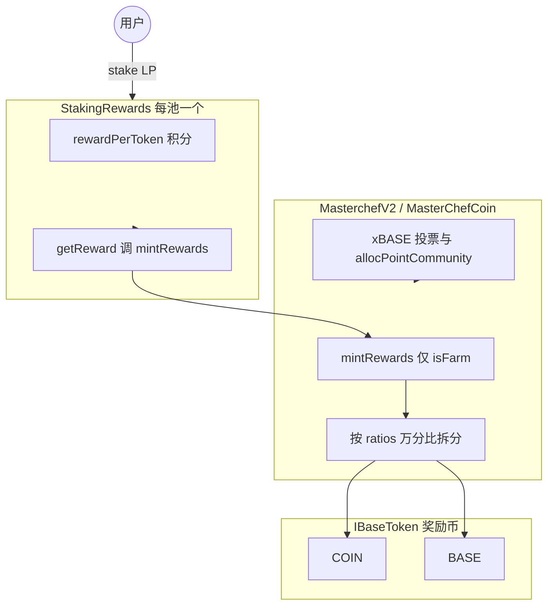

### 9.3 交互流程图（质押 → 领取）

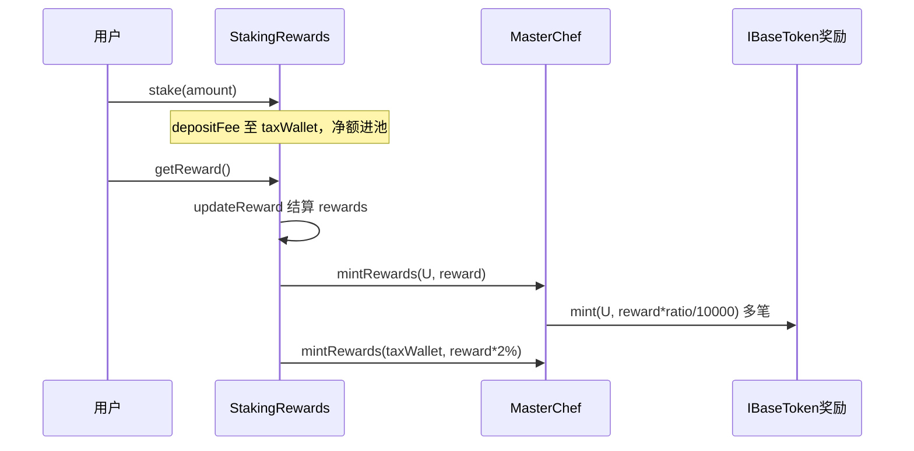

### 9.4 实现与使用注意

- **权限**：只有 `isFarm[Farm合约]=true` 才能 `mintRewards`；不要用未注册的合约冒充 Farm。
- **计量单位**：`StakingRewards` 里 `reward` 是内部积分换算后的数量，与 Chef 侧 `ratios` 相乘后再由各代币 `mint` 实际精度需一致（均为同一套 `1e18` 计量惯例）。
- **MasterChefCoin 额外入口**：`mintRewardsByAddress` 供 `minters` 白名单绕过 Farm 比例直接对单币 `mint`，适合运营活动，链上需严格管 `minters`。
- **Factory 与 V2**：`StakingRewardsFactory` 无多币与投票；选型时以产品需求为准。
- **Lottery**：见 [`Lottery.sol`](masterchefv2/Lottery.sol) 合约头注释，与 Chef 分属不同业务线。

更细的函数级 NatSpec 见上述各 `.sol` 文件内注释。

---

## 10. OtcSwap（xBASE → BASE）

[`masterchefv2/OtcSwap.sol`](masterchefv2/OtcSwap.sol) 实现 **链上柜台兑换**：用户将 **xBASE** 转入 **Owner 地址**（协议国库/多签），按固定 **`swapRate`（百分数，默认 35）** 从合约储备的 **BASE** 中获得 `amount * swapRate / 100`。合约需在兑换前由 Owner **`supplyBASE`** 注入 BASE；源码标注曾用于 **Arbiscan** 验证（2023-05-15）。与 AMM 市价无关，属于 **协议定价的 OTC 池**。

### 10.1 业务场景与实例

| 场景 | 说明 |
|------|------|
| **xBASE 退出/回购** | 用户持有挖矿或包装得到的 xBASE，希望换成流动性更好的 BASE；不走 Uniswap 滑点，按公示比例与合约兑换。 |
| **国库收 xBASE** | 用户支付的 xBASE 全部进入 **`owner()`**，便于团队销毁、再质押或做市，链上 `totalXBASE` 可辅助统计累计回购量。 |
| **运营调参** | Owner 在 **25%～50%** 间调整 `swapRate`，应对市场或代币经济策略；需同步保证合约内 BASE 余额充足，否则 `otcSwap` 会 `Insufficient BASE`。 |

**简例**：`swapRate = 35`，用户 `approve(OtcSwap, 1000e18)` 后调用 `otcSwap(1000e18)`：向 Owner 转 **1000** 枚 xBASE，用户收到 **350** 枚 BASE（若合约内 BASE ≥ 350）；`totalXBASE` 增加 1000。若协议希望提高兑付比例，Owner 调用 `changeSwapRate(40)`，则同等 1000 xBASE 可换 **400** BASE。

### 10.2 架构图（资金与角色）

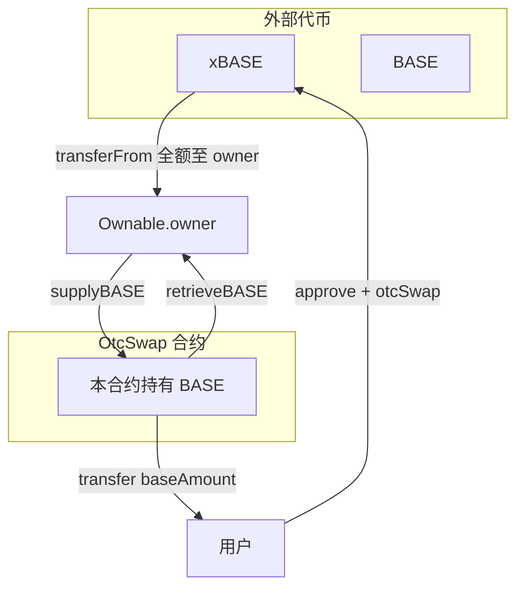

说明：`supplyBASE` 为 Owner 向合约注入 BASE；`retrieveBASE` 为 Owner 从合约取回 BASE；用户只从合约领取 **`otcSwap` 计算的 BASE**。

### 10.3 交互流程图（一次兑换）

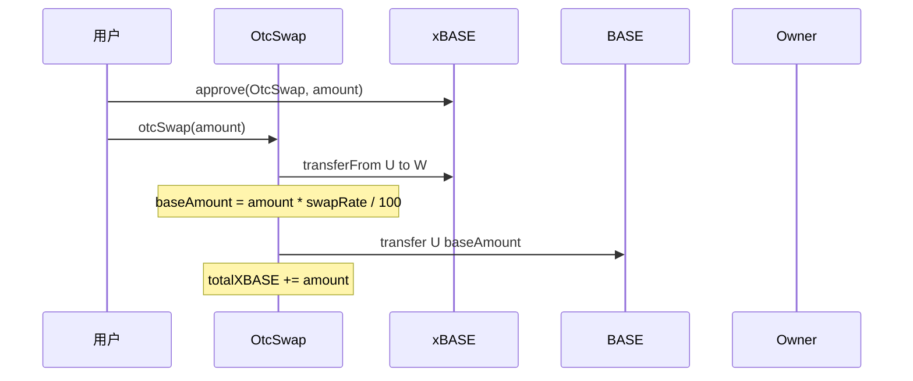

### 10.4 实现与使用注意

- **无滑点 AMM**：汇率仅由 `swapRate` 决定，不读取链上池子价格；可能与二级市场存在套利空间，需运营与风控配合。
- **Owner 收款**：xBASE 直接进入 **owner()**，若 Owner 为合约须能接收 ERC20。
- **整数除法**：`baseAmount = amount * swapRate / 100` 向下取整，极小 `amount` 可能得到 0 但仍转走全额 xBASE（业务上应避免极小笔）。
- **BASE 流动性**：须 **`supplyBASE`** 预存；`retrieveBASE` 可随时抽走 BASE，影响用户兑付能力。

更细的 NatSpec 见 [`masterchefv2/OtcSwap.sol`](masterchefv2/OtcSwap.sol)。

---

## 11. BaseTokenLocker

[`BaseTokenLocker.sol`](BaseTokenLocker.sol) 提供 **任意 ERC20（常见为 Uniswap V2 风格 LP Token）的定时锁仓**：用户将代币转入合约并约定 **解锁时间** 与 **领取地址 `withdrawer`**，协议按 **BaseToken 固定费** + **锁仓代币万分比抽成** 向营销地址收费。适用于「团队/做市方承诺一段时间内不抛售 LP」等透明展示场景。

### 11.1 业务场景与实例

| 场景 | 说明 |
|------|------|
| **LP 锁仓背书** | 项目方将 **BASE/ETH** 等池子的 **LP Token** 锁入合约 6～12 个月，向社区证明短期内不会撤池砸盘；解锁后由指定多签地址取回 LP。 |
| **融资/合作条款** | 投资方要求创始人将部分 **项目代币或 LP** 锁至 **TGE 后某时间**，`withdrawer` 设为团队多签，到期再领取。 |
| **收费模型** | 每次锁仓需额外支付 **`lockFee` 数量的 BASE**（可 Owner 调整），并从本笔锁仓代币中扣 **`lpLockFee`（万分比）** 给 `marketingAddress`，用于协议运营或营销。 |

**简例**：某用户在 Base 上为 SwapBased 池子添加流动性后得到 **100 枚 LP**；团队承诺锁仓 180 天。用户调用 `lockTokensByBase(LP_TOKEN, teamMultisig, 100e18, unlockTs)`，先 **approve** LP 与 BASE，合约扣除 0.5% LP 与 10 万枚 BASE 级固定费（具体以部署参数为准）后，将剩余 LP 记在合约内；180 天后 **`teamMultisig`** 调用 `withdrawTokens(id)` 取回。

### 11.2 架构图（角色与资金）

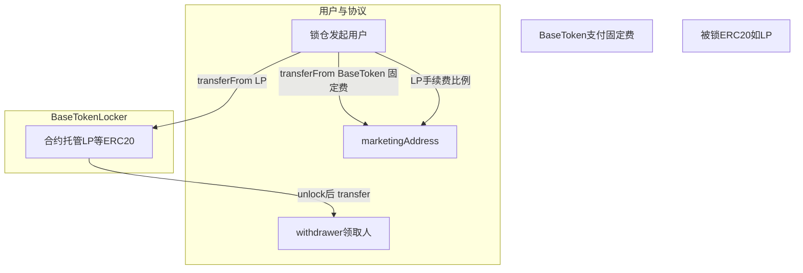

### 11.3 交互流程图（锁仓与解锁）

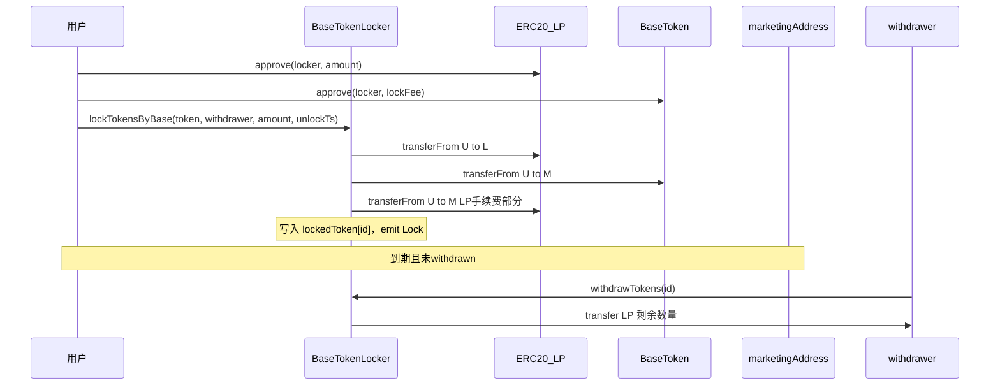

### 11.4 实现与使用注意

- **索引**：`depositsByWithdrawer`、`getDepositsByTokenAddress` 便于前端按人/按代币列出全部 `id`。
- **`walletTokenBalance`**：在 `lock` 时增加 **存入者** 名下余额，在 `withdraw` 时从 **领取者 `msg.sender`** 名下扣减；若 **`withdrawer` 与存入者不同**，需自行核对是否与业务预期一致（链上原逻辑以源码为准）。
- **费用参数**：`lockFee` / `lpLockFee` / `BaseToken` / `marketingAddress` 均可由 Owner 配置（见 `setLockFee`、`setLpLockFee`、`setBaseToken`、`setMarketingAddress`）。
- **链下展示**：锁仓证明通常结合 **区块浏览器 + 本合约事件 `Lock`** 与 **`lockedToken(id)`** 公开读数做页面展示。

更细的函数说明、参数含义与分支注释见源码内 NatSpec。

---

## 12. Vaults v2（xBASE / oCOIN / 单币质押）

[`vaultsv2/`](vaultsv2/) 与 [`masterchefv2/`](masterchefv2/) **无源码 import 依赖**，通过部署时写入 **`masterChef` 地址**与 **代币地址** 对接：衍生代币合约（xBASE、oCOIN）在 **claim / instantExit** 等路径调用 **`IMasterChef.mintRewards`**；单币质押合约则与 `StakingRewards` 同构，由 **Chef 或简化工厂** 控制 **`setRewardRate`** 与 **铸币**。Solidity **0.8.12**（xBASE、oCOIN）与 **^0.5.16**（`SingleStakingRewards*`）并存。

### 12.1 业务场景与实例

| 组件 | 说明 |
|------|------|
| **xBASE** | 用户 **`lock`**：转入 BASE → 合约销毁 BASE 并 **1:1 铸 xBASE**；**`vest` / `vestHalf`** 销毁 xBASE 并记录归属；**`claim`** 到期后 **`mintRewards(msg.sender, totalVested)`**。Operator 可 **`mint`** 增发。 |
| **oCOIN** | 用户 **`lock`**：转入 COIN 并销毁，**1:1 铸 oCOIN**；**`vest` / `vestBond`** 长期归属；**`instantExit`** 付 **WETH**（经 `quotePrice`，V2 储备或 V3 TWAP）并 **`mintRewards`**；**`claim`** 归属结束领奖励。 |
| **SingleStakingRewardsBase / XBase** | 与主仓库 **`StakingRewards`** 类似：**`getReward` → `mintRewards` + taxWallet 协议费**；Base 版 **`setRewardRate`** 可由 **Chef 或 taxWallet**；XBase 版 **仅 Chef** 可改速率。 |
| **SingleStakingRewardsOtherTokens** | 奖励从本合约 **`rewardsToken` 余额** 转出，**不调用 MasterChef**，适合预注资池。 |
| **SingleStakingRewardsFactoryXBase** | 在 vault 侧部署的 **单币奖励工厂**，`mintRewards` 只铸 **一个 `rewardsToken`**，语义接近 **`StakingRewardsFactory`**。 |

**简例**：部署 `MasterChefCoin` 后，将地址写入 **`xBASE.setMasterChef`**。用户从 AMM 取得 BASE，**`lock` 得到 xBASE**，参与治理投票（Chef 的 `xBASE` 指针指向该代币）。另一用户持有 COIN，**`oCOIN.lock`** 得到 oCOIN，选择 **`vest`** 到期 **`claim`**，Chef 按池 **`ratios`** 铸 COIN/BASE 等。

### 12.2 架构图（与 Chef 的关系）

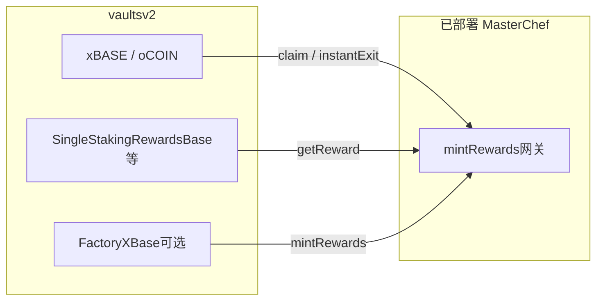

### 12.3 交互流程图（xBASE 归属领取）

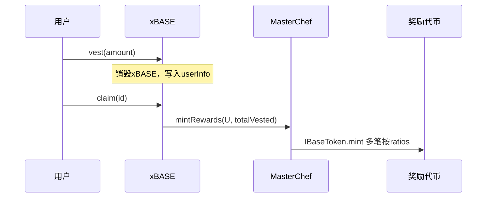

### 12.4 实现与使用注意

- **Chef 地址**：`xBASE` / `oCOIN` 的 `masterChef` 必须指向已部署且配置好 **Farm / ratios** 的 Chef，否则 `mintRewards` 会失败或非预期拆分。
- **价格预言**：`oCOIN` 的 `usingLegacyPair` / `tokenV3Pool` / `duration` 决定 **`quotePrice`** 行为，部署错误会导致 **`instantExit`** 支付额异常。
- **`remainTime`**：xBASE/oCOIN 中视图函数参数与 `msg.sender` 混用，前端调用 **`claim` 前** 建议以链上实测为准。
- **预存型 OtherTokens**：`SingleStakingRewardsOtherTokens` **不会** `mintRewards`，需事先向合约转入足够 **`rewardsToken`**。

更细的 NatSpec 见 [`vaultsv2/xBASE.sol`](vaultsv2/xBASE.sol)、[`vaultsv2/oCOIN.sol`](vaultsv2/oCOIN.sol) 及 `SingleStakingRewards*.sol`。

---

## 13. 合约地图（按文件）

### 13.1 根目录

| 文件                                                                  | 职责简述                                  |
| ------------------------------------------------------------------- | ------------------------------------- |
| `[UniswapV2Factory.sol](UniswapV2Factory.sol)`                      | 创建 Pair、feeTo 等                       |
| `[UniswapV2Pair.sol](UniswapV2Pair.sol)`                            | 流动性池、swap、mint/burn LP、价格累计           |
| `[UniswapV2ERC20.sol](UniswapV2ERC20.sol)`                          | LP Token ERC20 与 permit               |
| `[UniswapV2Router02.sol](UniswapV2Router02.sol)`                    | 用户入口：加流动性、swap、ETH 包装等                |
| `[BaseToken.sol](BaseToken.sol)` / `[CoinToken.sol](CoinToken.sol)` | 项目代币实现（含 OpenZeppelin 风格片段）           |
| `[BaseTokenLocker.sol](BaseTokenLocker.sol)`                        | 代币锁仓相关逻辑                              |
| `[Multicall2.sol](Multicall2.sol)`                                  | 批量静态调用，便于前端聚合读                        |
| `[interfaces/](interfaces/)`                                        | Uniswap V2 与 IERC20 等接口               |
| `[libraries/](libraries/)`                                          | `SafeMath`、`Math`、`UQ112x112`         |
| `[helpers/](helpers/)`                                              | `Ownable`、`Context`、`ReentrancyGuard` |

### 13.2 `masterchefv2/`

| 文件                                                                    | 职责简述                                             |
| --------------------------------------------------------------------- | ------------------------------------------------ |
| `[MasterchefV2.sol](masterchefv2/MasterchefV2.sol)`                   | 主 MasterChef：注册 Farm、`mintRewards`、alloc、投票（见第 9 节） |
| `[MasterChefCoin.sol](masterchefv2/MasterChefCoin.sol)`               | 同上 + `minters` + `mintRewardsByAddress`（见第 9 节）   |
| `[StakingRewards.sol](masterchefv2/StakingRewards.sol)`               | 单池质押与奖励积分、`getReward` 调 MasterChef（见第 9 节）        |
| `[StakingRewardsFactory.sol](masterchefv2/StakingRewardsFactory.sol)` | 简化版 Chef + 部署 StakingRewards（见第 9 节）              |
| `[OtcSwap.sol](masterchefv2/OtcSwap.sol)`                             | xBASE→BASE 固定比例 OTC（见第 10 节）                      |
| `[Lottery.sol](masterchefv2/Lottery.sol)`                             | 抽奖类合约                                            |

### 13.3 `vaultsv2/`

| 文件                                                                                      | 职责简述                          |
| --------------------------------------------------------------------------------------- | ----------------------------- |
| `[xBASE.sol](vaultsv2/xBASE.sol)`                                                       | xBASE、归属与 `mintRewards`（见第 12 节）   |
| `[oCOIN.sol](vaultsv2/oCOIN.sol)`                                                       | oCOIN、归属/即时退出、V2/V3 价格（见第 12 节）   |
| `[SingleStakingRewardsBase.sol](vaultsv2/SingleStakingRewardsBase.sol)` 等               | 单币质押、`mintRewards` 变体（见第 12 节）   |
| `[SingleStakingRewardsFactoryXBase.sol](vaultsv2/SingleStakingRewardsFactoryXBase.sol)` | 单币奖励工厂（见第 12 节）                 |
| `[farms.json](vaultsv2/farms.json)`                                                     | 前端/运营用农场列表元数据（**非链上配置**）      |

### 13.4 其它

| 文件                                 | 职责简述                                      |
| ---------------------------------- | ----------------------------------------- |
| `[test/ERC20.sol](test/ERC20.sol)` | 测试用简易 ERC20                               |
| `[funding.json](funding.json)`     | 外部资助/Retro 相关 `projectId` 元数据，**不参与合约逻辑** |

---

## 14. Solidity 版本与依赖说明

- 仓库内 **Solidity 版本不统一**：例如 Uniswap 核心多为 **0.5.16**，`masterchefv2` 中 `StakingRewards` 为 **^0.5.16**，`OtcSwap` 为 **^0.8.0**（内嵌 OZ v4 风格片段），`vaultsv2` 部分为 **0.8.12** 等。
- 部分文件内嵌 **OpenZeppelin** 或大段 **Etherscan 验证用** 扁平化代码；实际部署时常以 npm 依赖为准，学习时以**当前文件内 import 与 pragma** 为准。
- 根目录 **未发现** `foundry.toml` 或 `hardhat.config.`*：本仓库以**源码阅读**为主；若要 fork 测试需自行初始化 Hardhat/Foundry 工程并引入这些合约。

---

## 15. 学习路径建议

1. 读 `UniswapV2Pair` 的 `swap` / `mint` / `burn` 与 `lock` 修饰器，理解重入保护与余额检查。
2. 读 `StakingRewards` 的 `rewardPerToken`、`earned`、`updateReward`、`getReward`。
3. 读 `MasterchefV2` 的 `mintRewards`、`_updatePool`、`votePool` 与 Owner 管理函数。
4. 对照 **上文第 9 节** 与 `masterchefv2` 下 `StakingRewards` / `MasterChefCoin`，建立「Chef 网关 + Farm」整体心智模型。
5. 阅读 **上文第 12 节** 与 [`vaultsv2/xBASE.sol`](vaultsv2/xBASE.sol)、[`vaultsv2/oCOIN.sol`](vaultsv2/oCOIN.sol)、`SingleStakingRewards*.sol`，理解衍生代币与 Chef 的衔接。
6. 对照 [`BaseToken.sol`](BaseToken.sol) 与上文第 8 节，理解 BASE 的 Operator 铸币与初始分配。
7. 阅读 [`masterchefv2/OtcSwap.sol`](masterchefv2/OtcSwap.sol) 与上文第 10 节，理解 xBASE→BASE 的固定比例 OTC 与 Owner 注资。
8. 阅读 `BaseTokenLocker` 的锁仓/解锁与费用逻辑（见上文第 11 节）。
9. 对照 [`CoinToken.sol`](CoinToken.sol) 与上文第 7 节，理解 `minters` / Operator 与 Farm 奖励的配合。
10. 用 `[INTERVIEW_PREP.md](INTERVIEW_PREP.md)` 做闭卷问答，回到源码标出行号加深记忆。

---

## 16. 诚实边界

- 链上部署地址、具体代币经济参数、Owner 多签情况需以**目标网络**的区块浏览器为准。
- 未附带完整测试套件时，**数学边界、权限组合**应以形式化审查或自建测试为准；本指南不替代安全审计。

若你发现源码与本文描述不一致，**以仓库内 Solidity 为准**，并欢迎更新文档。