# SwapBased V2 Core 学习指南

本文档面向希望**系统理解本仓库**、并达到**面试可深入讲解**水平的读者。与 [`INTERVIEW_PREP.md`](INTERVIEW_PREP.md) **配套使用**：学习指南负责**体系化知识与章节深度**，面试准备负责**分主题问答与速查**。

---

## 0. 文档说明、阅读路线与章节索引

### 0.1 两文档怎样配合

| 文档 | 定位 | 建议用法 |
|------|------|----------|
| **本指南（LEARNING_GUIDE）** | 架构、模块、流程图、合约地图、学习路径 | 第一遍通读建立地图；查具体模块时按章节跳转 |
| **[INTERVIEW_PREP.md](INTERVIEW_PREP.md)** | 高频考点、自测问答、速查清单 | 读完相关章节后做对应字母块；面试前看该文档 **G 节** |

### 0.2 章节总览（与面试块对照）

| 章 | 标题 | 内容摘要 | 面试准备 |
|----|------|----------|----------|
| **1** | 项目一句话 | 仓库定位 | **F3** 一句话介绍 |
| **2** | 整体架构 | 分层、数据流图 | **F** 综合 |
| **3** | 设计思路 | 为何 Chef 网关、奖励与投票 | **C** |
| **4** | 核心用户流程 | 交易→质押→领奖→投票 | **F** |
| **5** | Uniswap V2 核心 | CPAMM、Router、TWAP 要点 | **A** | 
| **6** | Vaults v2 要点（速览） | xBASE/oCOIN/单币池提纲 | 预习 **D**；详解见 **§12** |
| **7** | CoinToken | COIN 权限与场景；**§7.0** 定位、**§7.4** 经济模型与串联 | 代币经济 / **E** 特权 |
| **8** | BaseToken | BASE 与 COIN 分工；**§8.1.1** 首发+Operator 经济模型 | 同上 |
| **9** | Chef + Farm | 控权铸币、StakingRewards | **B、C** |
| **10** | OtcSwap | xBASE→BASE OTC | 与 **§8/§12** 衔接 |
| **11** | BaseTokenLocker | LP 锁仓与费用 | 工具层 |
| **12** | Vaults v2（详解） | 与 Chef 衔接、单币池差异；**§12.5** xBASE、**§12.6** oCOIN 专节 | **D、F1** |
| **13** | 合约地图 | 按目录速查文件；**§13.1.1** 说明 `interfaces/` 与 ABI | 定位源码 |
| **14** | Solidity 与依赖 | 版本、扁平化代码 | **E3** |
| **15** | 学习路径建议 | 推荐阅读顺序 | 与 **§0.3** 一致 |
| **16** | 诚实边界 | 链上/审计边界 | **E** |

### 0.3 三条阅读路线（可选）

1. **快速鸟瞰（约 30～60 分钟）**：**§1 → §2 → §4 → §9.1～9.2 → §13**（合约地图），再扫 **INTERVIEW_PREP G 节**。
2. **系统精读（与 §15 一致）**：按 **§15** 编号顺序，每读完一章在 **INTERVIEW_PREP** 做对应「面试块」（见上表）。
3. **面试冲刺**：以 **INTERVIEW_PREP** 为主线，每题不会的回到上表「章」跳转本指南与源码。

---

> **第一篇 · 总览与架构**（建立全局图：产品是什么、数据怎么流、用户怎么走）

---

## 1. 项目一句话

本仓库是 **DEX（Uniswap V2 系 AMM）+ 流动性挖矿（MasterChef + StakingRewards）+ 若干衍生代币与单币质押池** 的 Solidity 源码集合，奖励通过 **可铸造代币（`IBaseToken.mint`）** 发放，MasterChef 作为 **唯一可信的「铸币网关」** 按池配置拆分多币种奖励。

---

## 2. 整体架构

### 2.1 分层视图


| 层级      | 作用                                              | 本仓库主要合约                                                                |
| ------- | ----------------------------------------------- | ---------------------------------------------------------------------- |
| 交易与流动性  | 恒定乘积做市、LP Token、路由.swap                         | `UniswapV2Factory` / `UniswapV2Pair` / `UniswapV2Router02`             |
| 挖矿与治理权重 | 注册 Farm、全局每秒产出、池子权重、社区投票加成、按池铸造奖励               | `MasterchefV2` 或 `MasterChefCoin`                                      |
| 单池质押    | 用户质押 LP 或其它 ERC20，累积「应得奖励」，领取时向 MasterChef 申请铸币 | `masterchefv2/StakingRewards.sol`、`vaultsv2/SingleStakingRewards*.sol` |
| 衍生代币    | xBASE、oCOIN 等：锁仓、归属、即时退出等，部分路径同样走 `mintRewards` | `vaultsv2/xBASE.sol`、`vaultsv2/oCOIN.sol`                              |


### 2.2 数据流（核心）

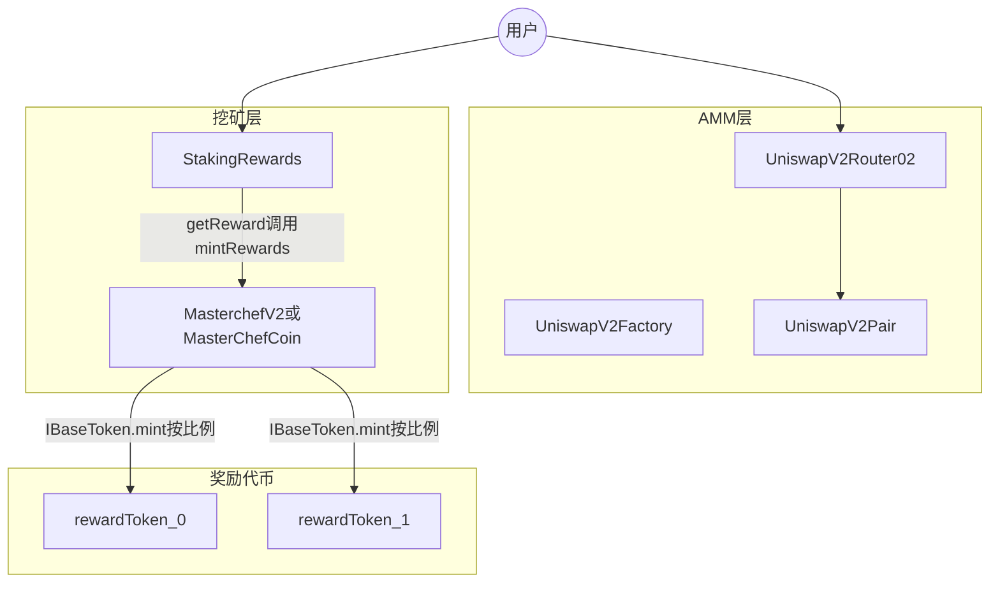


**关键设计**：`StakingRewards` 合约内**不必预先存放**全部奖励代币余额；用户应得金额用 `rewardPerToken` / `earned` 累计，领取时把「记账金额」交给 MasterChef，由 MasterChef 按该池的 `rewards[]` 与 `ratios[]`（万分比）调用多个代币的 `mint`。

---

## 3. 设计思路（为什么这样拆）

### 3.1 为何用 MasterChef 做铸币网关？

- **权限收敛**：只有 `isFarm[msg.sender]` 的合约能调用 `mintRewards`，避免任意合约伪造奖励。
- **多奖励代币**：一个池可配置多个 `IBaseToken`，`mintRewards` 内按 `ratios[i] / 10000` 拆分（见 `[masterchefv2/MasterchefV2.sol](masterchefv2/MasterchefV2.sol)`）。
- **与 Synthetix 式 StakingRewards 解耦**：Farm 只负责「分蛋糕」与记账；铸币策略与代币经济在代币合约侧实现。

### 3.2 StakingRewards 的奖励模型（直觉）

- 把每秒释放的奖励 `rewardRate` 均摊到**当前质押总量**上，得到「每单位质押每秒累积的奖励」，再积分得到 `rewardPerToken`。
- 用户维度用 `userRewardPerTokenPaid` 与 `rewards` 记录「已结算部分」与「待领取余额」，典型 **Synthetix StakingRewards** 写法。
- 领取时 `getReward()` 先清零本地 `rewards[msg.sender]`，再调用 `IMasterChef(masterChef).mintRewards(msg.sender, reward)`；另对 `taxWallet` 铸 **2%** `ownerFee`（见 `[masterchefv2/StakingRewards.sol](masterchefv2/StakingRewards.sol)`）。

### 3.3 MasterChef 中的「池子控制」与「投票」

- `**masterchefControlled`**：为 true 时，Owner 通过 `_updatePool` 根据全局 `globalSkullPerSecond`、`allocPoint` 等**同步**该池 `StakingRewards.rewardRate`。
- `**isVoteable` 与 `allocPointCommunity`**：可投票池在基础分配之外，再叠加社区分配；用户通过 `votePool` / `unVotePool` 使用 `xBASE` 余额（及可选的单币质押余额）作为投票权，调整各池 `allocPointCommunity`。内部在 `increaseAllocation` / `decreaseAllocation` 中，若距离上次更新超过 **7 天** 会触发 `_massUpdatePools`，再更新 `lastUpdatedTimeVotes`。

### 3.4 `MasterchefV2` 与 `MasterChefCoin` 的差异

两者主体逻辑一致。`**MasterChefCoin`** 额外包含：

- `mapping(address => bool) public minters` 与 `onlyRewardsMinter`；
- `mintRewardsByAddress(receiver, amount, token)`：由白名单地址直接对**指定代币** `mint`，不经过 Farm 的 `ratios` 拆分。

部署时 `MasterChefCoin` 构造函数会把 `minters[msg.sender]` 设为 true（部署者）。

---

## 4. 核心用户流程（端到端）

1. **交易 / 加池**：用户通过 `UniswapV2Router02` 与 `UniswapV2Pair` 交互（swap、addLiquidity），获得 LP Token（Pair 合约的 ERC20）。
2. **质押**：用户向已部署的 `StakingRewards` `approve` 后 `stake`；可能扣 **1%** `depositFee` 到 `taxWallet`。
3. **累积奖励**：`rewardPerToken()` 随时间增长；`earned(user)` 为待领取数量。
4. **领取**：`getReward()` → `MasterChef.mintRewards` → 各奖励代币 `mint` 到用户（及税费地址）。
5. **投票（可选）**：持有 `xBASE`（及可选质押）的用户 `votePool(pid)`，影响社区奖励分配；`mintRewards` 前会 `updateVotePool` 同步投票权变化。

---

> **第二篇 · AMM 交易层**（与 **INTERVIEW_PREP · A** 对应）

---

## 5. Uniswap V2 核心（本仓库片段）

- **恒定乘积**：`reserve0 * reserve1` 在单笔 swap 后不减（扣除手续费后仍满足池子规则）；`swap` 前会更新累计价格用于 TWAP（`[UniswapV2Pair.sol](UniswapV2Pair.sol)`）。
- **手续费与协议费**：标准 V2 逻辑，`feeOn` 时可能向 `feeTo` 铸造流动性（`_mintFee`）。
- **Router**：封装 `addLiquidity` / `swapExactTokensForTokens` 等，处理比例、最小输出、deadline。

---

> **衔接：Vaults 速览**（与 **§12**、**INTERVIEW_PREP · D** 对应；本篇仅列要点）

---

## 6. Vaults v2 要点

- `**xBASE`**：包装 BASE 类代币，带归属（vesting）等；与 `IMasterChef` 集成用于奖励结算（见 `[vaultsv2/xBASE.sol](vaultsv2/xBASE.sol)`）。
- `**oCOIN**`：与 `coinToken`、WETH、可选 V2/V3 价格源结合；支持 `lock`/`vest`/`instantExit`/`claim` 等；部分出口调用 `IMasterChef(masterChef).mintRewards`（见 `[vaultsv2/oCOIN.sol](vaultsv2/oCOIN.sol)`）。
- `**SingleStakingRewardsBase` / `XBase` / `OtherTokens**`：与 `masterchefv2/StakingRewards` 同思路的单币质押变体，用于不同质押资产或奖励路径。

更细的架构、流程与文件说明见 **第 12 节**。

---

> **第三篇 · 协议代币与锁仓工具**（**§7～§8** 代币经济；**§11** 合规/营销向锁仓；可与 **INTERVIEW_PREP · E** 特权风险对照）

---

## 7. CoinToken（COIN）

[`CoinToken.sol`](CoinToken.sol) 实现协议内 **COIN** 代币：在 OpenZeppelin 风格 **ERC20 + ERC20Burnable** 基础上，增加 **`minters` 白名单铸造**、**Operator 角色**（救币与维护铸造者）、以及对 **`burnFrom` / `transferFrom` 的显式覆盖**。COIN 通常作为 **流动性挖矿、质押或衍生品（如 oCOIN）路径中的奖励/计价代币**，由经治理接入的合约按经济模型 `mint` 给用户或池子。

### 7.0 COIN 存在的意义（协议定位）

**COIN 在本仓库里承担的是「多入口、可治理的奖励型 ERC20」：通胀出口由 `minters` 白名单分散到多个业务合约（而非单一地址随意铸），与 **BASE**（**§8**）的「单 Operator 控铸 + 首发大额」形成分工。**

| 维度 | 说明 |
|------|------|
| **相对 BASE 为何单独要 COIN** | **BASE** 侧重底池、费用、协议级计价与 **Operator 单一铸币权**；**COIN** 则面向 **流动性挖矿、多 Farm、多路径同时结算奖励**——用 **`minters` 映射** 把铸币权拆给 **MasterChef、StakingRewards、其它已接入合约**，便于在不改 BASE 供应规则的前提下，单独设计 **挖矿排放与游戏/衍生品**（如 **oCOIN**）。 |
| **信任与运维分层** | **Owner** 管 **`transferOperator`**；**Operator** 管 **`setMinters`**（谁可 `mint` / `burnFrom`）与 **`governanceRecoverUnsupported`**（误转杂币救回）。**日常发奖**由已列入白名单的 **Chef / Farm** 调 **`mint`**，无需 Operator 每笔人工操作。 |
| **销毁与权限** | 任意持有人可 **`burn`** 自减供应；**`burnFrom` 被设为 `onlyMinter`**，避免「仅凭 allowance 即可被第三方销毁他人 COIN」的通用 ERC20 行为，把**代他人销毁**收敛到与白名单铸造者同一信任域（治理/合规场景）。 |

**一句话**：COIN = **面向挖矿与多协议奖励的 COIN 资产** + **`minters` 控制的多点铸币** + **Operator 维护白名单与救币**；与 BASE 的用途与铸币模型不同，常成对出现在同一产品里。

### 7.1 业务场景与实例

| 场景 | 说明 |
|------|------|
| **Farm 奖励** | `MasterChefCoin` 等将本合约地址配置为奖励代币之一，并把 Chef 合约（或路由合约）加入 `minters`；用户 `getReward` 时由 Chef 调用 `coinToken.mint(user, amount)` 发放 COIN。 |
| **用户主动销毁** | 用户持有 COIN 后可调用 `burn`，减少流通量（通缩或游戏化销毁）。 |
| **oCOIN 等衍生品** | 如 [`vaultsv2/oCOIN.sol`](vaultsv2/oCOIN.sol) 中用户锁仓/操作会 `IERC20(coinToken).transferFrom` 或 `burn`，COIN 与包装代币形成闭环。 |
| **误转救回** | 用户若向 `CoinToken` 合约地址误转 **其它 ERC20**，Operator 可调用 `governanceRecoverUnsupported` 将误转代币转回指定多签或用户地址（**不**用于随意划走用户正常业务中的 COIN）。 |

**简例**：团队在 Base 上部署 `CoinToken`，部署者成为首个 `minter`；随后 Operator 执行 `setMinters(masterChefAddress, true)`，使 Farm 仅在奖励结算时增发 COIN。用户将 COIN 与 ETH 在 AMM 加池做 LP，再将 LP 质押到 `StakingRewards`，领取时收到 COIN 奖励并可在前端选择部分 `burn` 或参与 oCOIN 锁仓。

### 7.2 架构图（角色与权限）

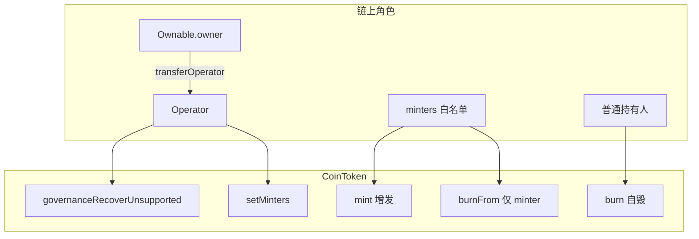

### 7.3 交互流程图

**铸造（典型奖励发放）**

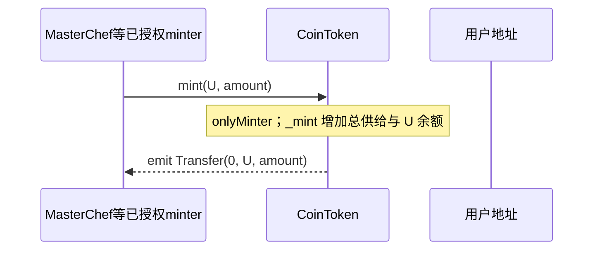

**Operator 维护铸造者与救币**

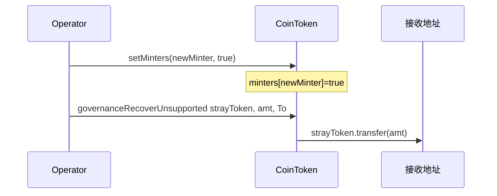

### 7.4 经济模型与核心函数串联

#### 经济模型（供给与角色）

| 项目 | 说明 |
|------|------|
| **供给增加** | 仅 **`mint(recipient, amount)`**，且 **`onlyMinter`**。来源通常是 **`MasterChef` / `StakingRewards` 等**在 **`getReward`、`mintRewards`** 路径中按池规则计算额度后代用户接收 COIN。 |
| **供给减少** | 用户 **`burn(amount)`** 销毁**本人**余额；**`burnFrom(account, amount)`** 仅 **minter** 可调用（需 `account` 对本合约的 allowance），用于治理指定的集中销毁，**非**日常用户路径。 |
| **谁改铸币权** | **`setMinters(minter, bool)`** 仅 **Operator**；上线新 Farm 或下线旧合约时常要同步增删白名单。 |
| **与 BASE 对比（速记）** | **BASE**：`mint` **onlyOperator**，部署时一次性大额初始供应（见 **§8**）。**COIN**：`mint` **onlyMinter**，**无**内置「首发百万」逻辑，排放依赖业务合约调用频率与额度。 |

#### 核心函数在实际业务中如何串联

1. **部署**：`constructor` 将 **`minters[msg.sender] = true`**，部署者可先自测 `mint` 或配合脚本做冷启动。  
2. **接入挖矿**：**Operator** 对 **`setMinters(masterChefOrStaking, true)`**，使奖励结算交易内可 **`CoinToken.mint(user, …)`**；若 Chef 聚合多币奖励，COIN 常是 **`ratios`** 中的一种（见 **§9**）。  
3. **用户侧持有 COIN 之后**：与其它 ERC20 一样 **`transfer` / `approve` + `transferFrom`**（本合约显式重写 **`transferFrom`**，语义与标准一致）；可去 **AMM 做 LP**、与 **`oCOIN.lock`** 等 **`transferFrom` COIN**、或 **`burn`** 参与通缩/活动。  
4. **运维**：新池上线 → **加 minter**；退役池 → **`setMinters(old, false)`** 防止旧合约仍可铸币。误向 **本合约地址** 转入**非 COIN** 的 ERC20 → **`governanceRecoverUnsupported`** 转回指定地址。  
5. **Owner / Operator**：**Owner** 更换 **Operator**（`transferOperator`）；**Operator** 不直接「铸给用户」除非把自己（或某地址）也设为 **minter** 且自行调用 `mint`——通常仍由 **Chef 合约**按规则铸。

#### 端到端用户旅程（总览）

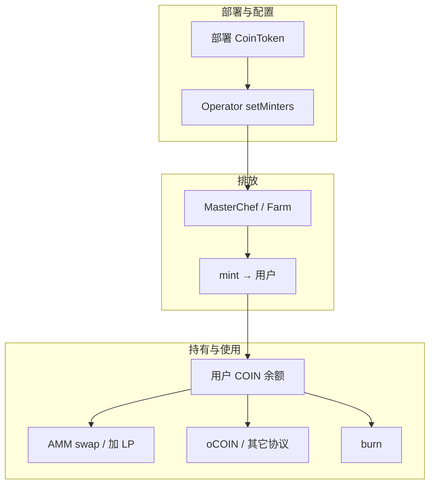

#### 函数搭配速查表

| 函数 | 典型调用者 | 业务含义 |
|------|------------|----------|
| `mint` | `minters` 内合约（Chef、Farm 等） | 奖励发放、排放 |
| `burn` | 任意持有人 | 自愿销毁 |
| `burnFrom` | 仅 minter | 代销毁（高权限，非常规） |
| `setMinters` | Operator | 接入/下线铸币者 |
| `transfer` / `transferFrom` | 用户、Router、oCOIN 等 | 流通与 DeFi 组合 |
| `governanceRecoverUnsupported` | Operator | 仅救**其它**代币误转，非日常转 COIN |

### 7.5 实现与使用注意

- **`burnFrom` 权限**：本合约将 `burnFrom` 限制为 **onlyMinter**，与标准 ERC20Burnable「任意 spender 在 allowance 内可销毁」不同，用于降低任意合约经授权销毁他人 COIN 的风险；普通用户销毁自有代币请用 **`burn`**。
- **`transferFrom`**：显式重写，逻辑与父类一致（先转账再扣 allowance），便于在继承链中固定行为。
- **Operator 信任假设**：`governanceRecoverUnsupported` 可转走本合约持有的任意 IERC20，需链下治理与多签约束 Operator。
- **与 Chef 的配合**：实际部署时需将负责 `mintRewards` 的合约加入 `minters`，否则奖励交易会在 `mint` 处 revert。

更细的 NatSpec 与参数说明见 [`CoinToken.sol`](CoinToken.sol) 内注释。

---

## 8. BaseToken（BASE）

[`BaseToken.sol`](BaseToken.sol) 实现 **BASE** 代币：继承 `ERC20Burnable` 与 `Operator`，**部署时一次性向部署者 mint 100 万枚 BASE**，后续 **`mint` 仅 `onlyOperator`**（无 `minters` 白名单）。BASE 常见用途包括 **底池资产、锁仓费（[`BaseTokenLocker`](BaseTokenLocker.sol)）、协议计价**；**COIN**（第 7 节）更适合 **多合约同时增发奖励**。

### 8.1 BASE 业务场景与实例

| 场景 | 说明 |
|------|------|
| **初始流动性** | 部署者持有 1,000,000 BASE，用于添加 BASE/ETH 或分发给合作方做市。 |
| **锁仓费** | `BaseTokenLocker` 的 `BaseToken` 常指向本合约，用户锁 LP 时支付 `lockFee` 的 BASE。 |
| **Operator 增发** | 治理将 `Operator` 设为运维地址，按路线图 `mint` 至金库或激励池（链下需约束用途）。 |

**简例**：部署完成后部署者获得 1e6 * 1e18 wei BASE；之后仅 Operator 可调 `mint(recipient, amount)`；用户可 `burn` 销毁自有 BASE。

### 8.1.1 经济模型：首发 100 万 + Operator 增发

**链上规则（摘要）**：构造函数向部署者 **`mint` 100 万枚 BASE**（`1000000 ether` 最小单位），形成**可审计的初始存量**；之后**仅 `Operator`** 可再次 `mint`，**无** COIN 式的 `minters` 多地址白名单。用户仍可 **`burn`** 自有代币；**`burnFrom`** 在本合约中为 **onlyOperator**（偏治理/合规设计）。

**适合的业务场景**

| 场景 | 说明 |
|------|------|
| **冷启动与做市** | 部署者用初始 100 万枚做首批 **BASE/ETH 等池流动性**、合作方分配、做市支持，快速把交易与深度做起来。 |
| **协议主资产 / 计价** | BASE 作为生态 **底池资产、锁仓费代币**（如 `BaseTokenLocker`）、展示或结算用的「主币」，需要一笔**明确、可披露**的初始供给，再按路线图由 Operator 释放或增发。 |
| **强管控的后续通胀** | 金库注资、激励、生态基金等需**继续铸币**时，只经 **单一 Operator**（常见为 **多签 / 时间锁** 背后的地址），与 **COIN + 多 `minters`**（多入口同时铸奖励）形成分工。 |

**不太匹配的场景**

- 强调 **无预挖、供给完全来自挖矿/池子** 的「公平发射」叙事时，**大额首发 + 可增发**需另行设计（如锁仓、线性释放、或换代币模型）。

**信任与披露**

- 后续通胀完全依赖 **Operator 是否可信**；链上建议配合 **治理多签、用途披露、预算公示**。
- **一句话**：该模型适合把 BASE 做成 **协议主干资产**——**先有明确初始筹码做流动性与合作**，**再由单一 Operator 代表治理做后续增发**；与 **第 7 节 COIN**「多入口铸奖励」常见搭配使用。

### 8.2 架构图（BASE 与 COIN 对照）

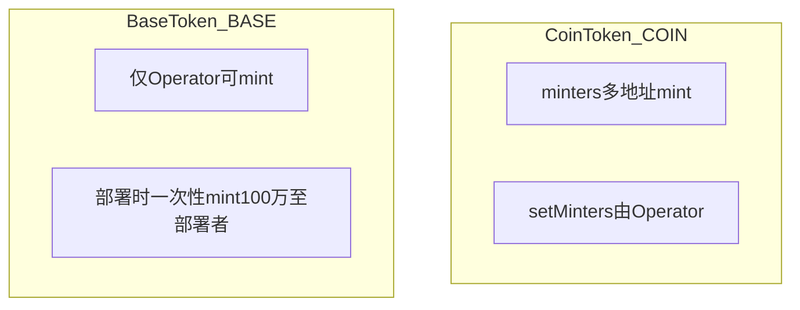

### 8.3 交互流程图（Operator 增发）

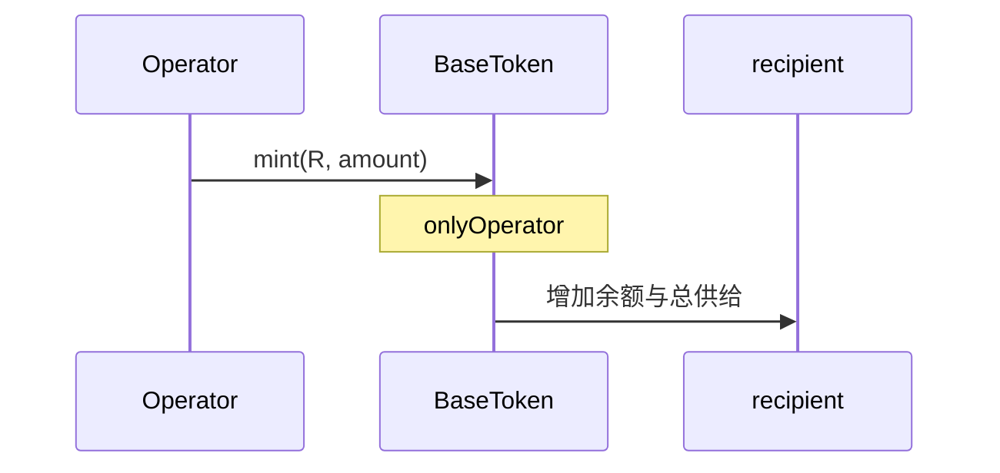

### 8.4 实现与使用注意

- **无 `minters`**：增发权集中在 Operator；若要让某合约直接 `mint` BASE，需将该合约设为 Operator 或由 Operator 预铸再转入（依部署策略而定）。
- **`rewardPoolDistributed`**：预留状态位，具体是否使用由外围脚本决定。
- **与 COIN 分工**：多 Farm、多入口同时 `mint` 更适合 **CoinToken**；单角色控通胀、初始大额分配更适合 **BaseToken**。

更细注释见 [`BaseToken.sol`](BaseToken.sol)。

---

> **第四篇 · 挖矿、治理与 OTC**（**§9** 与 **INTERVIEW_PREP · B、C**；**§10** 衔接 BASE/xBASE 流动性）

---

## 9. Chef 控权铸币 + 单池质押分奖 + 部署 Farm

本仓库在 [`masterchefv2/`](masterchefv2/) 下实现 **Synthetix 式单池质押（`StakingRewards`）** 与 **MasterChef 铸币网关** 的组合：Farm 合约**不预存**全部奖励代币，只在用户 `getReward` 时把累计的「奖励计量」交给 Chef，由 Chef **`mintRewards` → 各奖励代币 `IBaseToken.mint`**。**仅 `isFarm` 注册的地址**可调用 `mintRewards`，从而把增发权限从任意 ERC20 收束到已审计的 Farm。

涉及主文件：**[`MasterchefV2.sol`](masterchefv2/MasterchefV2.sol)**（多币 `ratios` + xBASE 投票）、**[`MasterChefCoin.sol`](masterchefv2/MasterChefCoin.sol)**（同上 + `mintRewardsByAddress` / `minters`）、**[`StakingRewards.sol`](masterchefv2/StakingRewards.sol)**（`rewardPerToken` / `earned` / `getReward`）、**[`StakingRewardsFactory.sol`](masterchefv2/StakingRewardsFactory.sol)**（单币奖励的简化 Chef）。**[`Lottery.sol`](masterchefv2/Lottery.sol)** 为独立抽奖逻辑，与 Chef 无直接铸币耦合。

### 9.1 业务场景与实例

| 场景 | 说明 |
|------|------|
| **部署 Farm** | Owner 调用 **`deployWithCreation(stakingToken, farmStartTime)`** 内联 `new StakingRewards`，或先外部部署 StakingRewards 再 **`deploy(farmAddress, startTime, masterchefControlled)`** 注册；`stakingRewardsGenesis` 之前不可 `mintRewards`。 |
| **多币奖励** | `MasterchefV2` / `MasterChefCoin` 每池配置 `rewards[]` 与 `ratios[]`（**万分比**）；`mintRewards` 内 `_amount * ratios[i] / 10000` 分别 `mint` 至 COIN、BASE 等。 |
| **权重与每秒产出** | Owner 设 `globalSkullPerSecond`、`set(pid, allocPoint)`；若 `masterchefControlled`，`_updatePool` 按权重把全局速率写成该池 `StakingRewards.setRewardRate`。 |
| **社区投票加成** | 用户持有 xBASE（及可选单币质押计票）`votePool(pid)`，增加该池 `allocPointCommunity`，与 `globalCommunitySkullPerSecond` 叠加到 `rewardRate`（至少隔 7 天可触发全量 `_massUpdatePools`）。 |
| **简化工厂** | `StakingRewardsFactory` 仅向单一 `rewardsToken` `mint`，适合单一代币激励的早期或侧链部署。 |

**简例**：团队在 Base 部署 `MasterchefV2`，构造函数传入 `[COIN, BASE]` 与 `[5000, 5000]`（万分比各 50%）。Owner `deployWithCreation(BASE_ETH_LP, start)` 生成 Farm A；用户向 Farm A `stake(LP)`，一段时间后 `getReward()`：Farm 调用 `mintRewards(user, R)`，Chef 向用户铸 `R*50%` 的 COIN 与 `R*50%` 的 BASE，并另对用户奖励的 2% 再铸给 `taxWallet`（见 `StakingRewards` 中 `ownerFee`）。

### 9.2 架构图

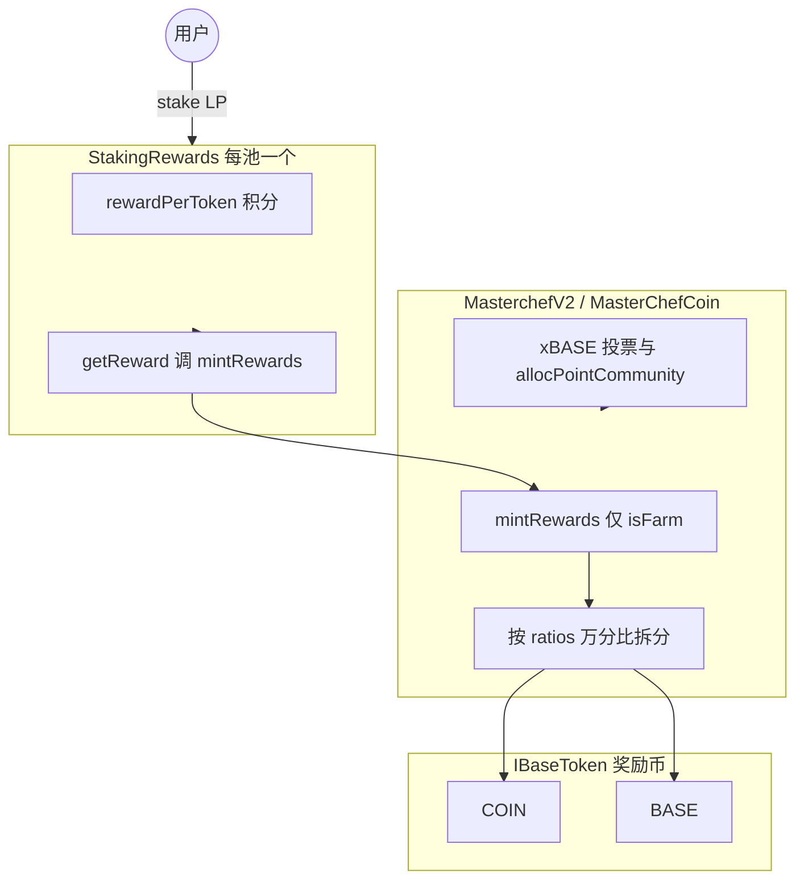

### 9.3 交互流程图（质押 → 领取）

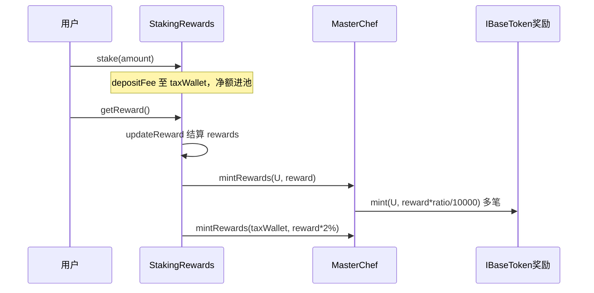

### 9.4 实现与使用注意

- **权限**：只有 `isFarm[Farm合约]=true` 才能 `mintRewards`；不要用未注册的合约冒充 Farm。
- **计量单位**：`StakingRewards` 里 `reward` 是内部积分换算后的数量，与 Chef 侧 `ratios` 相乘后再由各代币 `mint` 实际精度需一致（均为同一套 `1e18` 计量惯例）。
- **MasterChefCoin 额外入口**：`mintRewardsByAddress` 供 `minters` 白名单绕过 Farm 比例直接对单币 `mint`，适合运营活动，链上需严格管 `minters`。
- **Factory 与 V2**：`StakingRewardsFactory` 无多币与投票；选型时以产品需求为准。
- **Lottery**：见 [`Lottery.sol`](masterchefv2/Lottery.sol) 合约头注释，与 Chef 分属不同业务线。

更细的函数级 NatSpec 见上述各 `.sol` 文件内注释。

---

## 10. OtcSwap（xBASE → BASE）

[`masterchefv2/OtcSwap.sol`](masterchefv2/OtcSwap.sol) 实现 **链上柜台兑换**：用户将 **xBASE** 转入 **Owner 地址**（协议国库/多签），按固定 **`swapRate`（百分数，默认 35）** 从合约储备的 **BASE** 中获得 `amount * swapRate / 100`。合约需在兑换前由 Owner **`supplyBASE`** 注入 BASE；源码标注曾用于 **Arbiscan** 验证（2023-05-15）。与 AMM 市价无关，属于 **协议定价的 OTC 池**。

### 10.1 业务场景与实例

| 场景 | 说明 |
|------|------|
| **xBASE 退出/回购** | 用户持有挖矿或包装得到的 xBASE，希望换成流动性更好的 BASE；不走 Uniswap 滑点，按公示比例与合约兑换。 |
| **国库收 xBASE** | 用户支付的 xBASE 全部进入 **`owner()`**，便于团队销毁、再质押或做市，链上 `totalXBASE` 可辅助统计累计回购量。 |
| **运营调参** | Owner 在 **25%～50%** 间调整 `swapRate`，应对市场或代币经济策略；需同步保证合约内 BASE 余额充足，否则 `otcSwap` 会 `Insufficient BASE`。 |

**简例**：`swapRate = 35`，用户 `approve(OtcSwap, 1000e18)` 后调用 `otcSwap(1000e18)`：向 Owner 转 **1000** 枚 xBASE，用户收到 **350** 枚 BASE（若合约内 BASE ≥ 350）；`totalXBASE` 增加 1000。若协议希望提高兑付比例，Owner 调用 `changeSwapRate(40)`，则同等 1000 xBASE 可换 **400** BASE。

### 10.2 架构图（资金与角色）

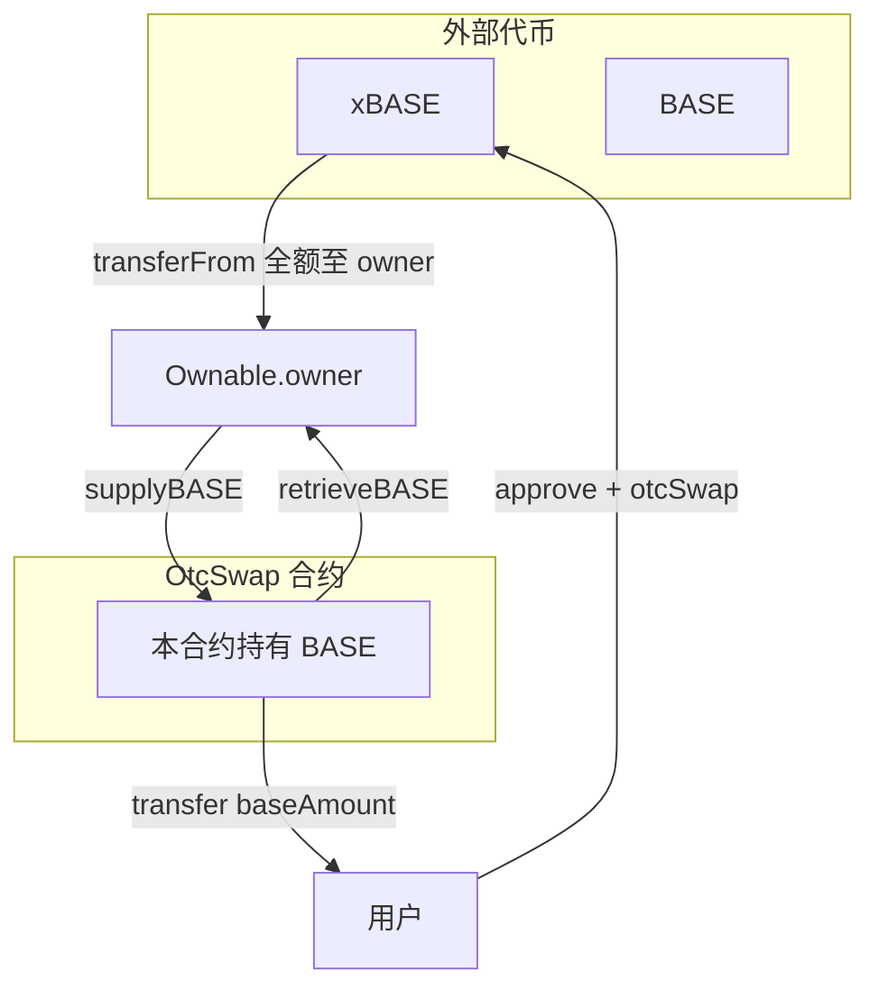

说明：`supplyBASE` 为 Owner 向合约注入 BASE；`retrieveBASE` 为 Owner 从合约取回 BASE；用户只从合约领取 **`otcSwap` 计算的 BASE**。

### 10.3 交互流程图（一次兑换）

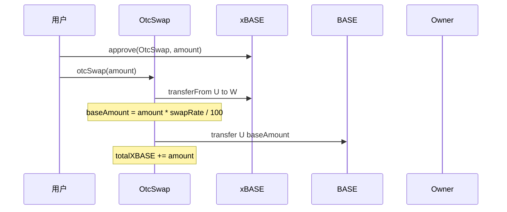

### 10.4 实现与使用注意

- **无滑点 AMM**：汇率仅由 `swapRate` 决定，不读取链上池子价格；可能与二级市场存在套利空间，需运营与风控配合。
- **Owner 收款**：xBASE 直接进入 **owner()**，若 Owner 为合约须能接收 ERC20。
- **整数除法**：`baseAmount = amount * swapRate / 100` 向下取整，极小 `amount` 可能得到 0 但仍转走全额 xBASE（业务上应避免极小笔）。
- **BASE 流动性**：须 **`supplyBASE`** 预存；`retrieveBASE` 可随时抽走 BASE，影响用户兑付能力。

更细的 NatSpec 见 [`masterchefv2/OtcSwap.sol`](masterchefv2/OtcSwap.sol)。

---

> **工具合约 · LP 锁仓**（与 **§8 BaseToken** 费用支付常配合使用）

---

## 11. BaseTokenLocker

[`BaseTokenLocker.sol`](BaseTokenLocker.sol) 提供 **任意 ERC20（常见为 Uniswap V2 风格 LP Token）的定时锁仓**：用户将代币转入合约并约定 **解锁时间** 与 **领取地址 `withdrawer`**，协议按 **BaseToken 固定费** + **锁仓代币万分比抽成** 向营销地址收费。适用于「团队/做市方承诺一段时间内不抛售 LP」等透明展示场景。

### 11.1 业务场景与实例

| 场景 | 说明 |
|------|------|
| **LP 锁仓背书** | 项目方将 **BASE/ETH** 等池子的 **LP Token** 锁入合约 6～12 个月，向社区证明短期内不会撤池砸盘；解锁后由指定多签地址取回 LP。 |
| **融资/合作条款** | 投资方要求创始人将部分 **项目代币或 LP** 锁至 **TGE 后某时间**，`withdrawer` 设为团队多签，到期再领取。 |
| **收费模型** | 每次锁仓需额外支付 **`lockFee` 数量的 BASE**（可 Owner 调整），并从本笔锁仓代币中扣 **`lpLockFee`（万分比）** 给 `marketingAddress`，用于协议运营或营销。 |

**简例**：某用户在 Base 上为 SwapBased 池子添加流动性后得到 **100 枚 LP**；团队承诺锁仓 180 天。用户调用 `lockTokensByBase(LP_TOKEN, teamMultisig, 100e18, unlockTs)`，先 **approve** LP 与 BASE，合约扣除 0.5% LP 与 10 万枚 BASE 级固定费（具体以部署参数为准）后，将剩余 LP 记在合约内；180 天后 **`teamMultisig`** 调用 `withdrawTokens(id)` 取回。

### 11.2 架构图（角色与资金）

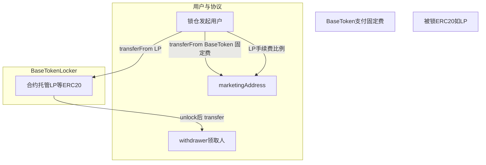

### 11.3 交互流程图（锁仓与解锁）

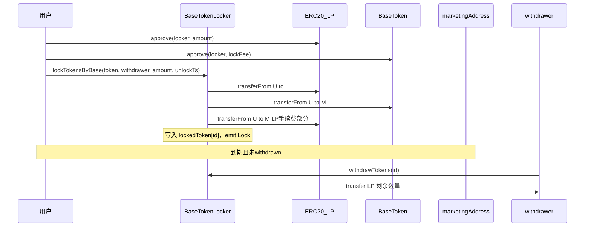

### 11.4 实现与使用注意

- **索引**：`depositsByWithdrawer`、`getDepositsByTokenAddress` 便于前端按人/按代币列出全部 `id`。
- **`walletTokenBalance`**：在 `lock` 时增加 **存入者** 名下余额，在 `withdraw` 时从 **领取者 `msg.sender`** 名下扣减；若 **`withdrawer` 与存入者不同**，需自行核对是否与业务预期一致（链上原逻辑以源码为准）。
- **费用参数**：`lockFee` / `lpLockFee` / `BaseToken` / `marketingAddress` 均可由 Owner 配置（见 `setLockFee`、`setLpLockFee`、`setBaseToken`、`setMarketingAddress`）。
- **链下展示**：锁仓证明通常结合 **区块浏览器 + 本合约事件 `Lock`** 与 **`lockedToken(id)`** 公开读数做页面展示。

更细的函数说明、参数含义与分支注释见源码内 NatSpec。

---

> **第五篇 · Vaults 与 MasterChef 衔接**（**§6** 为本篇速览；**§12** 为详解；与 **INTERVIEW_PREP · D、F1** 对应）

---

## 12. Vaults v2（xBASE / oCOIN / 单币质押）

[`vaultsv2/`](vaultsv2/) 与 [`masterchefv2/`](masterchefv2/) **无源码 import 依赖**，通过部署时写入 **`masterChef` 地址**与 **代币地址** 对接：衍生代币合约（xBASE、oCOIN）在 **claim / instantExit** 等路径调用 **`IMasterChef.mintRewards`**；单币质押合约则与 `StakingRewards` 同构，由 **Chef 或简化工厂** 控制 **`setRewardRate`** 与 **铸币**。Solidity **0.8.12**（xBASE、oCOIN）与 **^0.5.16**（`SingleStakingRewards*`）并存。

### 12.1 业务场景与实例

| 组件 | 说明 |
|------|------|
| **xBASE** | 用户 **`lock`**：转入 BASE → 合约销毁 BASE 并 **1:1 铸 xBASE**；**`vest` / `vestHalf`** 销毁 xBASE 并记录归属；**`claim`** 到期后 **`mintRewards(msg.sender, totalVested)`**。Operator 可 **`mint`** 增发。 |
| **oCOIN** | 用户 **`lock`**：转入 COIN 并销毁，**1:1 铸 oCOIN**；**`vest` / `vestBond`** 长期归属；**`instantExit`** 付 **WETH**（经 `quotePrice`，V2 储备或 V3 TWAP）并 **`mintRewards`**；**`claim`** 归属结束领奖励。 |
| **SingleStakingRewardsBase / XBase** | 与主仓库 **`StakingRewards`** 类似：**`getReward` → `mintRewards` + taxWallet 协议费**；Base 版 **`setRewardRate`** 可由 **Chef 或 taxWallet**；XBase 版 **仅 Chef** 可改速率。 |
| **SingleStakingRewardsOtherTokens** | 奖励从本合约 **`rewardsToken` 余额** 转出，**不调用 MasterChef**，适合预注资池。 |
| **SingleStakingRewardsFactoryXBase** | 在 vault 侧部署的 **单币奖励工厂**，`mintRewards` 只铸 **一个 `rewardsToken`**，语义接近 **`StakingRewardsFactory`**。 |

**简例**：部署 `MasterChefCoin` 后，将地址写入 **`xBASE.setMasterChef`**。用户从 AMM 取得 BASE，**`lock` 得到 xBASE**，参与治理投票（Chef 的 `xBASE` 指针指向该代币）。另一用户持有 COIN，**`oCOIN.lock`** 得到 oCOIN，选择 **`vest`** 到期 **`claim`**，Chef 按池 **`ratios`** 铸 COIN/BASE 等。

### 12.2 架构图（与 Chef 的关系）

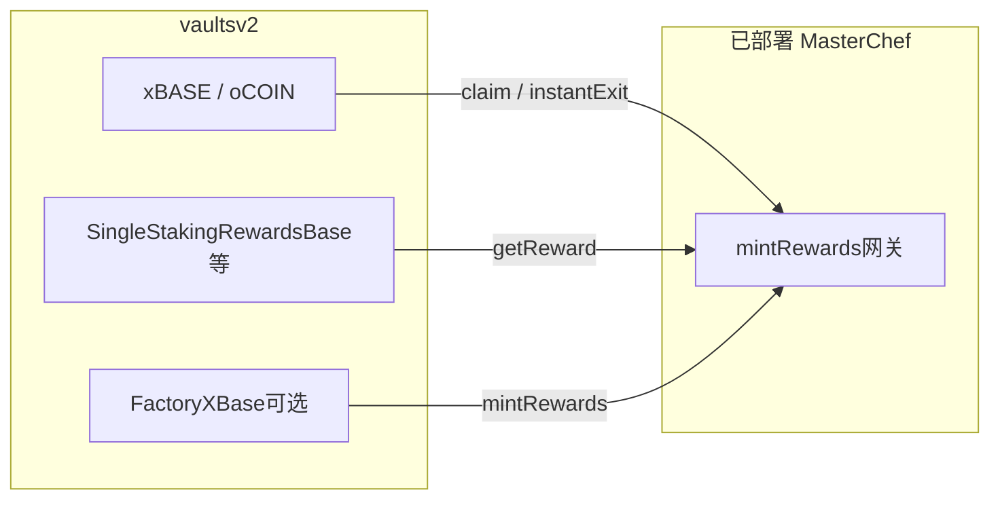

### 12.3 交互流程图（xBASE 归属领取）

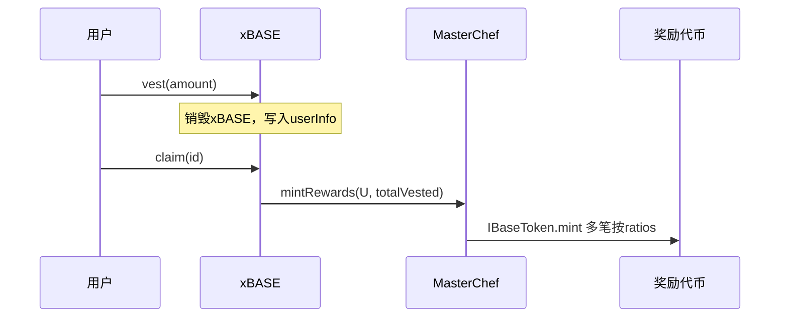

### 12.4 实现与使用注意

- **Chef 地址**：`xBASE` / `oCOIN` 的 `masterChef` 必须指向已部署且配置好 **Farm / ratios** 的 Chef，否则 `mintRewards` 会失败或非预期拆分。
- **价格预言**：`oCOIN` 的 `usingLegacyPair` / `tokenV3Pool` / `duration` 决定 **`quotePrice`** 行为，部署错误会导致 **`instantExit`** 支付额异常。
- **`remainTime`**：xBASE/oCOIN 中视图函数参数与 `msg.sender` 混用，前端调用 **`claim` 前** 建议以链上实测为准。
- **预存型 OtherTokens**：`SingleStakingRewardsOtherTokens` **不会** `mintRewards`，需事先向合约转入足够 **`rewardsToken`**。

更细的 NatSpec 见 [`vaultsv2/xBASE.sol`](vaultsv2/xBASE.sol)、[`vaultsv2/oCOIN.sol`](vaultsv2/oCOIN.sol) 及 `SingleStakingRewards*.sol`。

### 12.5 xBASE 专节：场景、经济模型、`rewardRate` 与函数串联

对应源码：[`vaultsv2/xBASE.sol`](vaultsv2/xBASE.sol)。本节把 **xBASE** 从「一句表」展开为可落地的**业务串联**：谁在什么时机调什么函数、资金与计量如何变化。

#### 12.5.0 xBASE 存在的作用（协议定位）

**xBASE 解决的是：在不动用「直接增发 BASE」的前提下，为协议提供一层可识别、可组合、可治理的「参与凭证」，并把「愿意长期参与 / 归属后再领奖」与现货流通的 BASE 区分开。**

| 维度 | 作用 |
|------|------|
| **相对 BASE 的角色** | 用户通过 **`lock`** 将 **BASE 销毁**并 **1:1 换入 xBASE**：链上把「已选择进入协议经济/治理圈」的份额记为 **xBASE**，与仍在 AMM 或钱包里自由流转的 **BASE** 在账户形态上分离；赎回或变现可走其它产品路径（如 **§10** OtcSwap 等），不在此重复。 |
| **与 MasterChef 的硬绑定** | [`MasterchefV2.sol`](masterchefv2/MasterchefV2.sol) 部署时写入 **`address public xBASE`**；**社区投票**（为池子争取 **`allocPointCommunity`**）使用的 **`getTotalVotePower`** = **`IERC20(xBASE).balanceOf(user)`** + 可选的 **单币质押池**内余额（`countDepositAmountAsVotingPower` 为 true 的 Farm）。因此在本仓库设计里，**xBASE 是 Chef 侧认定的「治理/投票权」代币载体**，而非任意 ERC20 皆可替换。 |
| **奖励发放网关** | **`vest` / `vestHalf` → `claim`** 将归属计量 **`totalVested`** 交给 **`mintRewards`**，与 **§9** 所述 Chef 多币 **`ratios`** 铸币一致，使「归属结束领奖励」与 Farm 发奖体系同源。 |
| **运维弹性** | **`mint`（Operator）** 可在 **`lock` 之外**向特定地址分配 xBASE，用于激励、合作与活动，与「用户自带 BASE 换 xBASE」并存。 |

**一句话**：xBASE = **BASE 的衍生参与凭证**（lock 销毁 BASE 换入）+ **Chef 治理投票权计量**（见 `MasterchefV2` 的 `xBASE` 与 `getTotalVotePower`）+ **归属后统一走 `mintRewards` 的领奖入口**。

#### 12.5.1 使用场景（产品侧）

| 场景 | 说明 |
|------|------|
| **BASE → xBASE 入口** | 用户持有 **BASE**，希望获得协议内常用的 **xBASE**（例如参与 **MasterChef** 中与 xBASE 相关的 Farm、投票权重、或其它依赖 xBASE 余额/质押的逻辑），走 **`lock`**：BASE 销毁、等量 xBASE 进入用户钱包。 |
| **延迟释放的「归属 → 领奖」** | 用户持有 xBASE，不立刻想卖或转出，而是愿意 **销毁 xBASE** 并开启一笔 **计时归属**；到期后 **`claim`**，由 **Chef** 按池子 **`ratios`** 铸造奖励（多币种），实现「用时间换奖励计量」的路径。 |
| **快慢两种归属** | **`vest`**：默认 **30 天**，`totalVested` 等于销毁的 xBASE 数量；**`vestHalf`**：**7 天**，但 `totalVested` 仅为销毁量的一半（`amount * 100 / 200`），适合更短周期、更低领奖计量。 |
| **运营增发** | **`mint`**（**Operator**）向指定地址增发 xBASE，用于活动、补偿、合作方分配等（与 `lock` 的「用户自带 BASE」不同）。 |
| **主动通缩** | **`burn`**：用户销毁自己的 xBASE，减少流通量（与 `vest` 中「为开仓位而销毁」语义不同：后者同时写入 `userInfo`）。 |

#### 12.5.2 经济模型（与 BASE / Chef 的关系）

- **`lock`**：用户 **`transferFrom` BASE 到 xBASE 合约 → 合约对 BASE 调用 **`burn`**（底层 BASE 通缩）→ 对用户 **`_mint` 等量 xBASE**。整体上可理解为：**BASE 从流通中移除，xBASE 作为「已锁凭证」1:1 进入用户**。  
- **`vest` / `vestHalf`**：用户 **`_burn` xBASE**，并在 **`userInfo[msg.sender]`** 追加一条 **`vestPosition`**（`totalVested`、`lastInteractionTime`、`VestPeriod`）。**流通 xBASE 减少**，但 **「待 claim 的计量」记在仓位里**。  
- **`claim`**：仅当归属时间结束（见 **`remainTime` == 0**），把该 **`id`** 的 **`totalVested`** 作为 **`mintRewards(receiver, amount)`** 的 **`amount`** 交给 **MasterChef**；Chef 再按部署配置把该数量拆成多代币铸造。**领奖金额由仓位里的 `totalVested` 决定，不是按秒乘 `rewardRate` 在 xBASE 内现算。**  
- **`mint`（Operator）**：无 BASE 进入合约，直接 **`_mint` xBASE**，属于 **协议侧通胀工具**。  
- **`burn`**：用户 **`_burn` 自己的 xBASE**，无 Chef、无仓位，纯减少余额。

**小结**：xBASE 合约内部**不实现「每秒线性释放」到用户余额**；**时间门槛**只体现在 **`remainTime` / `claim` 是否允许**，**实际铸币数量**是 **`totalVested` 一次性**交给 Chef。

#### 12.5.3 `rewardRate` 的作用（与 `claim` 的关系）

- **写入**：仅 **`setRewardRate(uint256)`**，修饰符 **`onlyMasterChef`**，即由已配置的 **`masterChef`** 合约调用，把 **`rewardRate`** 存成 **公共状态变量**。  
- **读取**：在 **`xBASE.sol` 源码中，`rewardRate` 未被 `lock` / `vest` / `vestHalf` / `claim` 读取**；`claim` 使用的数量是 **`position.totalVested`**。  
- **语义**：`rewardRate` 更适合理解为 **Chef 与 xBASE 合约之间的「参数同步 / 镜像」**（例如与全局每秒产出、某池展示、或链下脚本一致），**链上领奖路径以 `totalVested` + `mintRewards` 为准**。若部署侧从未从 Chef 回调 `setRewardRate`，该变量可为 0 且不影响 `claim` 逻辑。

#### 12.5.4 核心函数如何串联（典型用户旅程）

**路径 A：从 BASE 到归属领奖（最常见串联）**

1. 用户持有 **BASE**，`approve` xBASE 合约。  
2. **`lock(amount)`** → BASE 销毁 + 获得 **`amount` xBASE**。  
3. （可选）在生态内使用 xBASE（质押、投票等，取决于 Chef 与其它合约配置）。  
4. 选择 **`vest(x)`** 或 **`vestHalf(x)`** → **销毁 `x` 枚 xBASE**，新开一条 **`userInfo` 仓位**（索引为 **`userPositions - 1`** 或前端遍历的 `id`）。  
5. 等待 **`vestingPeriod`（30 天）** 或 **`shortVestingPeriod`（7 天）**。  
6. 前端或脚本用 **`remainTime(address, id)`** 判断是否到期（见下 **实现注意**）。  
7. **`claim(id)`** → **`masterChef.mintRewards(msg.sender, totalVested)`**，该仓位 **`totalVested` 置 0**。

**路径 B：Operator 与自愿销毁**

- **`mint(recipient, amount)`**：Operator 给某地址加 xBASE；之后该地址仍可走 **vest → claim** 或自行 **`burn`**。  
- **`burn(amount)`**：仅减少自己余额，**不产生** `userInfo` 仓位。

**对比表**

| 函数 | 谁调用 | BASE | xBASE 余额 | `userInfo` / Chef |
|------|--------|------|------------|-------------------|
| `lock` | 用户 | 销毁 | +等量 | 无 |
| `vest` | 用户 | — | −销毁量 | 新仓位，`totalVested`=销毁量 |
| `vestHalf` | 用户 | — | −销毁量 | 新仓位，`totalVested`=销毁量的一半 |
| `claim` | 用户 | — | — | 清该仓位，调 `mintRewards` |
| `mint` | Operator | — | recipient + | 无 |
| `burn` | 用户 | — | − | 无 |

#### 12.5.5 交互流程图

**总览（用户视角）**

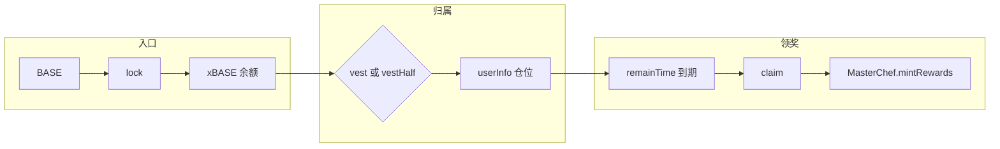

**时序（lock → vest → claim）**

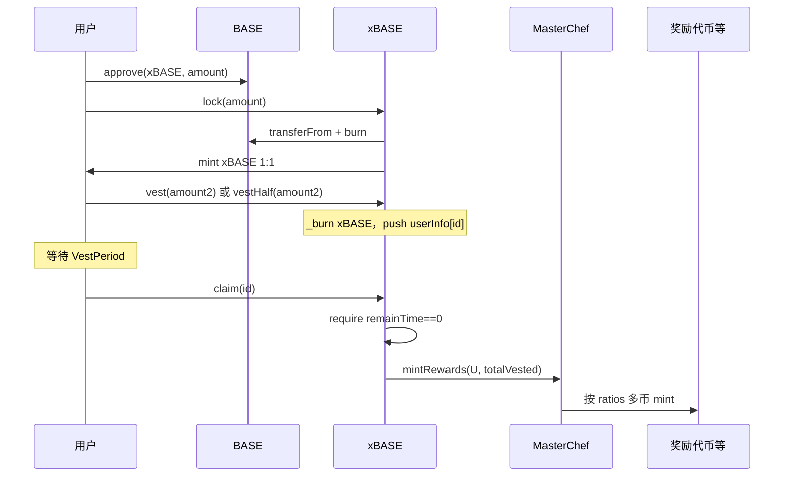

**Operator 与 burn（并行关系，非必经）**

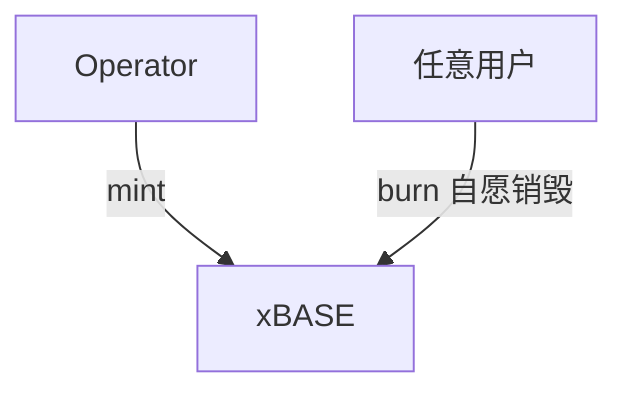

#### 12.5.6 `remainTime` 与实现注意

- **设计意图**：根据 **`lastInteractionTime`** 与 **`VestPeriod`** 计算**剩余秒数**，到期为 **0**，供 **`claim`** 前检查。  
- **源码细节**：[`remainTime`](vaultsv2/xBASE.sol) 中 **`timePass`** 使用 **`userInfo[_address][id]`**，而后续比较与返回值使用 **`userInfo[msg.sender][id]`**。调用时应以 **自己为 `msg.sender` 查询本人仓位** 为准，且与 **§12.4** 一致：**跨用户 / 只看 `_address` 可能不符合直觉**，前端务必在目标链上验证只读结果。

### 12.6 oCOIN 专节：场景、经济模型、`rewardRate` 与函数串联

对应源码：[`vaultsv2/oCOIN.sol`](vaultsv2/oCOIN.sol)。oCOIN 与 **§12.5** xBASE 同属「衍生 ERC20 + 归属 + `mintRewards`」族，但底层锚定 **COIN**（非 BASE），并额外支持 **`instantExit`（付 WETH 惩罚、链上询价）** 与更长的 **`vestBond`**。

#### 12.6.0 oCOIN 存在的意义（协议定位）

| 维度 | 说明 |
|------|------|
| **相对裸持 COIN** | 用户将 **COIN** 经 **`lock`** 销毁并换入 **oCOIN**，把「参与包装层规则」的份额与钱包里直接交易的 COIN 区分开；适合设计 **更长锁期、即时退出罚金、多币奖励出口（Chef）** 而不必改动 **[`CoinToken`](CoinToken.sol)** 主合约逻辑。 |
| **与 xBASE 的平行角色** | **xBASE** 锚定 **BASE** + 投票权（**§12.5.0**）；**oCOIN** 锚定 **COIN**，侧重 **奖励型 / 期权式归属** 与 **WETH 罚金退出**，二者都通过 **`claim` / `instantExit` → `IMasterChef.mintRewards`** 与 **Chef** 对齐。 |
| **价格与风控** | **`quotePrice`** 支持 **V2 储备价**（`usingLegacyPair` + `uniswapV2Pair`）或 **V3 `observe` + TickMath**（`tokenV3PoolAddress`、`duration`），用于 **`instantExit`** 计算用户应付 **WETH** 数量；部署错误会导致罚金或展示严重偏离预期（与 **§12.4** 一致）。 |

**一句话**：oCOIN = **COIN 的包装与归属载体** + **可选即时退出（WETH 惩罚 + 询价）** + **到期 `claim` 走 Chef**；**Operator** 另可通过 **`minters` + `mint`** 做 oCOIN 侧增发。

#### 12.6.1 使用场景（产品侧）

| 场景 | 说明 |
|------|------|
| **COIN → oCOIN 入口** | **`lock`**：用户 **`approve` oCOIN 合约，转入 COIN**，合约 **`burn` COIN** 并 **1:1 铸 oCOIN**（COIN 通缩，oCOIN 进入流通）。 |
| **耐心归属领奖** | **`vest`**：销毁 oCOIN，开 **60 天** 仓位，`totalVested` = 销毁量；到期 **`claim(id)`** → **`mintRewards`**。 **`vestBond`**：**150 天**，`totalVested` = 销毁量 × **`exitRatioBond` / 100**（默认 **150%** 计量，更长锁、更高领奖基数）。 |
| **等不及要流动性** | **`instantExit`**（需 **`optionEnabled`**）：销毁全部 `_amount` oCOIN，用户按 **`quotePrice`** 支付 **WETH** 给 **`_operator`**（金额为 **`(100 - exitRatio)%`** 对应的 COIN 名义经询价换算，默认 **`exitRatio = 30`** 即约 **70%** 部分参与罚金计价）；随后 **`mintRewards(msg.sender, exitAmount)`**。 |
| **运维** | **Owner**：`masterChef`、`weth`、V2/V3 池、`optionEnabled`、`exitRatio` / `exitRatioBond` 等。**Operator**：**`setMinters`**。**Minter**：**`mint`** 增发 oCOIN。 |
| **自愿销毁** | **`burn`**：减少自有 oCOIN，不产生归属仓位。 |

#### 12.6.2 经济模型（COIN / WETH / Chef）

- **`lock`**：COIN **销毁** + oCOIN **增发**（1:1），COIN 供应下降，oCOIN 代表「已进入包装层的凭证」。  
- **`vest` / `vestBond`**：oCOIN **销毁**，**`totalVested`** 记入 **`userInfo`**；到期 **`claim`** 一次性把 **`totalVested`** 交给 **`mintRewards`**（与 xBASE 相同：**不由 `rewardRate` 在合约内按秒推算**）。  
- **`instantExit`**：oCOIN **销毁**；用户支付 **WETH** 给 **Operator**（惩罚/通道费，数额由 **`quotePrice`** 与 **`exitRatio`** 共同决定）；**`mintRewards`** 的计量见下 **§12.6.6**（以链上当前实现为准）。  
- **`mint`（minter）**：无 COIN 进入本合约，直接 **`_mint` oCOIN**，用于激励或活动。  
- **`setRewardRate`**：仅 **MasterChef** 可写 **`rewardRate`** 状态变量；**`vest`/`claim`/`instantExit` 路径不读取该字段**（与 **§12.5.3** 同理，属镜像/外围同步用途）。

#### 12.6.3 核心函数如何串联（典型旅程）

**路径 A：COIN → 归属 → 领奖**

1. 用户持有 **COIN**，`approve` **oCOIN** 合约。  
2. **`lock(amount)`** → COIN 销毁 + **等量 oCOIN**。  
3. **`vest` 或 `vestBond`** → 销毁 oCOIN，新增 **`userInfo` 仓位**（记 `id`）。  
4. 等待 **`vestingPeriod`（60 天）** 或 **`bondVestingPeriod`（150 天）**；**`remainTime(msg.sender, id)`** 判到期。  
5. **`claim(id)`** → **`mintRewards(msg.sender, totalVested)`**。

**路径 B：等不及 → 即时退出**

1. 用户持有 oCOIN，准备足够 **WETH** 并 `approve` 本合约。  
2. **`instantExit(amount, maxPayAmount)`**（若开启）：销毁 oCOIN，**`transferFrom` WETH** 至 **`_operator`**，再 **`mintRewards`**。  
3. 用 **`quotePayment(amount)`**（视图）预估应付 WETH，与 **`maxPayAmount`** 配合防滑点。

**路径 C：激励增发**

- **Operator** **`setMinters(addr, true)`** 后，该地址可 **`mint`** oCOIN 给活动参与者，与 **`lock` 用户自带 COIN** 并存。

#### 12.6.4 交互流程图

**总览**

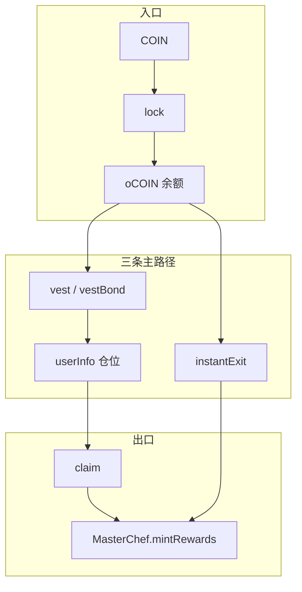

**时序：`lock` → `vest` → `claim`**

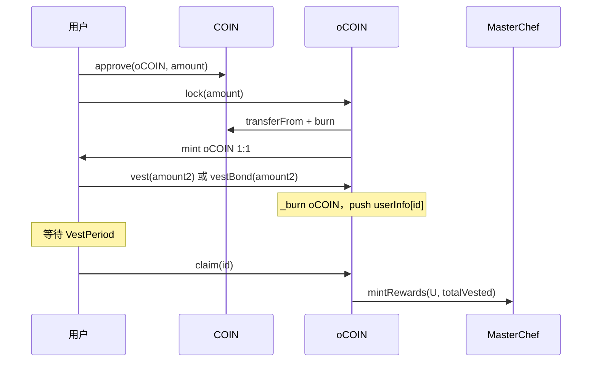

**时序：`instantExit`**

```mermaid
sequenceDiagram
  participant U as 用户
  participant W as WETH
  participant O as oCOIN
  participant Op as _operator
  participant C as MasterChef
  U->>W: approve(oCOIN, maxPay)
  U->>O: instantExit(amount, maxPayAmount)
  O->>O: _burn oCOIN
  O->>W: transferFrom U to Op（罚金路径）
  O->>C: mintRewards(U, exitAmount)
```

#### 12.6.5 函数搭配速查表

| 函数 | 作用摘要 |
|------|----------|
| `lock` | COIN 销毁 → oCOIN 1:1 |
| `vest` | 60 天归属，`totalVested` = 销毁量 |
| `vestBond` | 150 天归属，`totalVested` = 销毁量 × `exitRatioBond`/100 |
| `claim` | 到期，`mintRewards(totalVested)` |
| `instantExit` | 付 WETH + `mintRewards`（需 `optionEnabled`） |
| `quotePayment` / `quotePrice` | 视图：罚金与询价 |
| `mint` / `setMinters` | minter 增发；Operator 配白名单 |
| `burn` | 用户自毁 oCOIN |

#### 12.6.6 实现与读源码注意

- **`remainTime`**：与 **§12.5.6** 相同结构，**`_address` / `msg.sender` 混用**，请以 **`msg.sender` 本人仓位** 实测。  
- **`instantExit` 与 `exitRatio`**：用户支付的 WETH 由 **`(100 - exitRatio)%`** 与 **`quotePrice`** 决定；源码中 **`mintRewards` 前将 `exitAmount` 赋值为全额 `_amount`**（中间曾用 `exitRatio * _amount / PRECISION` 的局部变量会被覆盖），**链上实际 `mintRewards` 计量为整笔销毁的 `_amount`**。集成或审计时应以部署版本为准，勿仅依赖注释「30% liquid」字面。  
- **V2/V3 切换**：**Owner** 配置 **`usingLegacyPair`**、**`uniswapV2Pair`** 或 **`tokenV3PoolAddress`**、**`duration`**，错误会导致 **`quotePrice`** 异常。

---

> **第六篇 · 索引与元信息**（查文件、查版本、查边界；**§14～§16** 与 **INTERVIEW_PREP · E** 工程/安全题呼应）

---

## 13. 合约地图（按文件）

### 13.1 根目录


| 文件                                                                  | 职责简述                                  |
| ------------------------------------------------------------------- | ------------------------------------- |
| `[UniswapV2Factory.sol](UniswapV2Factory.sol)`                      | 创建 Pair、feeTo 等                       |
| `[UniswapV2Pair.sol](UniswapV2Pair.sol)`                            | 流动性池、swap、mint/burn LP、价格累计           |
| `[UniswapV2ERC20.sol](UniswapV2ERC20.sol)`                          | LP Token ERC20 与 permit               |
| `[UniswapV2Router02.sol](UniswapV2Router02.sol)`                    | 用户入口：加流动性、swap、ETH 包装等                |
| `[BaseToken.sol](BaseToken.sol)` / `[CoinToken.sol](CoinToken.sol)` | 项目代币实现（含 OpenZeppelin 风格片段）           |
| `[BaseTokenLocker.sol](BaseTokenLocker.sol)`                        | 代币锁仓相关逻辑                              |
| `[Multicall2.sol](Multicall2.sol)`                                  | 批量静态调用，便于前端聚合读                        |
| `[interfaces/](interfaces/)`                                        | Uniswap V2 与 IERC20 的 **Solidity 接口源码**（见下 **§13.1.1**） |
| `[libraries/](libraries/)`                                          | `SafeMath`、`Math`、`UQ112x112`         |
| `[helpers/](helpers/)`                                              | `Ownable`、`Context`、`ReentrancyGuard` |


### 13.1.1 `interfaces/`：Solidity 接口与 ABI 的关系、引用位置

**和「ABI」的关系（先澄清用语）**

- 本目录下是 **`.sol` 的 `interface` 声明**，不是名为 `*.abi` 的 JSON 文件。
- **ABI（Application Binary Interface）** 描述合约对外可调函数与事件的编码规则；用 Solidity 编译器编译合约或接口时，都会产出 **ABI JSON**（供前端、脚本、`ethers`/`viem` 等使用）。
- **链上**：其它合约通过 `import` 接口并 `IUniswapV2Pair(addr).swap(...)` 等方式调用，编译器用接口做类型检查并生成 **external call**。
- **链下**：需要部署地址 + **编译得到的 ABI JSON** 才能构造交易；本仓库 **根目录 `interfaces/` 不包含** 这些 JSON，一般在 Hardhat/Foundry 编译产物的 `artifacts/` 里，或由区块浏览器导出。

**本目录各文件职责（与 Uniswap V2 官方接口一致）**

| 文件 | 作用 |
|------|------|
| [`IUniswapV2Pair.sol`](interfaces/IUniswapV2Pair.sol) | Pair：储备、`swap`/`mint`/`burn`、累计价格、`permit` 等 |
| [`IUniswapV2Factory.sol`](interfaces/IUniswapV2Factory.sol) | Factory：`createPair`、`getPair`、`feeTo` 等 |
| [`IUniswapV2ERC20.sol`](interfaces/IUniswapV2ERC20.sol) | LP Token 的 ERC20 + `permit` |
| [`IUniswapV2Callee.sol`](interfaces/IUniswapV2Callee.sol) | 闪电贷回调 `uniswapV2Call` |
| [`IERC20.sol`](interfaces/IERC20.sol) | 最小 ERC20，供 Pair 内 `transfer` 调用 |

**在本仓库里谁 `import` 了根目录 `interfaces/`？**

- **[`UniswapV2Pair.sol`](UniswapV2Pair.sol)**：`IUniswapV2Pair`（实现继承）、`IERC20`、`IUniswapV2Factory`、`IUniswapV2Callee`。
- **[`UniswapV2ERC20.sol`](UniswapV2ERC20.sol)**：`IUniswapV2ERC20`（LP ERC20 实现继承）。

**未使用根目录 `interfaces/`、但「语义相同」的情况（避免重复找文件）**

- **[`UniswapV2Factory.sol`](UniswapV2Factory.sol)**、**[`UniswapV2Router02.sol`](UniswapV2Router02.sol)**：为 **扁平化单文件**（常见于浏览器验证），把同名 `interface` **全文拷在文件开头**，不单独 `import ./interfaces/`。
- **`masterchefv2/StakingRewards.sol`**、**`vaultsv2/SingleStakingRewards*.sol`**：仅在 `stakeWithPermit` 需要 `permit` 时，在 **文件末尾内联一小段 `interface IUniswapV2ERC20`**，避免对根目录的跨路径依赖。
- **[`vaultsv2/oCOIN.sol`](vaultsv2/oCOIN.sol)**：通过 **`@uniswap/v2-core`** npm 包引用 `IUniswapV2Pair`，与根目录 [`interfaces/IUniswapV2Pair.sol`](interfaces/IUniswapV2Pair.sol) **接口定义等价**，路径不同。

**小结**：根目录 `interfaces/` 是 **Uniswap V2 核心合约**（Pair / LP ERC20）的 **源码级接口**；**ABI JSON** 来自编译输出，用于链下；全仓库其它模块若只需 `permit`，往往 **内联最小接口** 或依赖 **npm 官方包**。

### 13.2 `masterchefv2/`


| 文件                                                                    | 职责简述                                             |
| --------------------------------------------------------------------- | ------------------------------------------------ |
| `[MasterchefV2.sol](masterchefv2/MasterchefV2.sol)`                   | 主 MasterChef：注册 Farm、`mintRewards`、alloc、投票（见第 9 节） |
| `[MasterChefCoin.sol](masterchefv2/MasterChefCoin.sol)`               | 同上 + `minters` + `mintRewardsByAddress`（见第 9 节）   |
| `[StakingRewards.sol](masterchefv2/StakingRewards.sol)`               | 单池质押与奖励积分、`getReward` 调 MasterChef（见第 9 节）        |
| `[StakingRewardsFactory.sol](masterchefv2/StakingRewardsFactory.sol)` | 简化版 Chef + 部署 StakingRewards（见第 9 节）              |
| `[OtcSwap.sol](masterchefv2/OtcSwap.sol)`                             | xBASE→BASE 固定比例 OTC（见第 10 节）                      |
| `[Lottery.sol](masterchefv2/Lottery.sol)`                             | 抽奖类合约                                            |


### 13.3 `vaultsv2/`


| 文件                                                                                      | 职责简述                          |
| --------------------------------------------------------------------------------------- | ----------------------------- |
| `[xBASE.sol](vaultsv2/xBASE.sol)`                                                       | xBASE、归属与 `mintRewards`（见第 12 节）   |
| `[oCOIN.sol](vaultsv2/oCOIN.sol)`                                                       | oCOIN、归属/即时退出、V2/V3 价格（见第 12 节）   |
| `[SingleStakingRewardsBase.sol](vaultsv2/SingleStakingRewardsBase.sol)` 等               | 单币质押、`mintRewards` 变体（见第 12 节）   |
| `[SingleStakingRewardsFactoryXBase.sol](vaultsv2/SingleStakingRewardsFactoryXBase.sol)` | 单币奖励工厂（见第 12 节）                 |
| `[farms.json](vaultsv2/farms.json)`                                                     | 前端/运营用农场列表元数据（**非链上配置**）      |


### 13.4 其它


| 文件                                 | 职责简述                                      |
| ---------------------------------- | ----------------------------------------- |
| `[test/ERC20.sol](test/ERC20.sol)` | 测试用简易 ERC20                               |
| `[funding.json](funding.json)`     | 外部资助/Retro 相关 `projectId` 元数据，**不参与合约逻辑** |


---

## 14. Solidity 版本与依赖说明

- 仓库内 **Solidity 版本不统一**：例如 Uniswap 核心多为 **0.5.16**，`masterchefv2` 中 `StakingRewards` 为 **^0.5.16**，`OtcSwap` 为 **^0.8.0**（内嵌 OZ v4 风格片段），`vaultsv2` 部分为 **0.8.12** 等。
- 部分文件内嵌 **OpenZeppelin** 或大段 **Etherscan 验证用** 扁平化代码；实际部署时常以 npm 依赖为准，学习时以**当前文件内 import 与 pragma** 为准。
- 根目录 **未发现** `foundry.toml` 或 `hardhat.config.`*：本仓库以**源码阅读**为主；若要 fork 测试需自行初始化 Hardhat/Foundry 工程并引入这些合约。
- **ABI JSON**：链下调用依赖编译产物中的 ABI；根目录 [`interfaces/`](interfaces/) 为 **Solidity 接口源码**，不是 ABI 文件；二者关系见 **§13.1.1**。

---

## 15. 学习路径建议

下列顺序与 **§0.2 章节总览**、**INTERVIEW_PREP** 各块一一对应；完成后建议按 **INTERVIEW_PREP · A→G** 自测。

| 步骤 | 建议阅读（本指南） | 自测（INTERVIEW_PREP） |
|------|-------------------|------------------------|
| 1 | **§5** `UniswapV2Pair` / Router、`lock` 修饰器 | **A** |
| 2 | **§9** + 源码 `StakingRewards`、`MasterchefV2` / `MasterChefCoin` | **B、C** |
| 3 | **§12** + `vaultsv2/xBASE`、`oCOIN`、`SingleStakingRewards*` | **D、F1** |
| 4 | **§8**、**§7** `BaseToken`、`CoinToken` | 代币分工 / **E** 特权 |
| 5 | **§10** `OtcSwap` | 与 xBASE/BASE 经济衔接 |
| 6 | **§11** `BaseTokenLocker` | 工具向 |
| 7 | **§1～§4** 总览（若尚未读） | **F3** 一句话 |
| 8 | **§16** 诚实边界；**§14** 版本说明 | **E** 工程与安全 |

**精简版（最小闭环）**：**§1～2 → §9 → §12 → §13**（合约地图），再 **INTERVIEW_PREP · G** 速查。

---

## 16. 诚实边界

- 链上部署地址、具体代币经济参数、Owner 多签情况需以**目标网络**的区块浏览器为准。
- 未附带完整测试套件时，**数学边界、权限组合**应以形式化审查或自建测试为准；本指南不替代安全审计。

若你发现源码与本文描述不一致，**以仓库内 Solidity 为准**，并欢迎更新文档。