# SwapBased V2 Core 学习指南

本文档面向希望**系统理解本仓库**、并达到**面试可深入讲解**水平的读者。阅读顺序建议：先通读本指南，再对照源码与 `[INTERVIEW_PREP.md](INTERVIEW_PREP.md)` 中的问题自测。

---

## 1. 项目一句话

本仓库是 **DEX（Uniswap V2 系 AMM）+ 流动性挖矿（MasterChef + StakingRewards）+ 若干衍生代币与单币质押池** 的 Solidity 源码集合，奖励通过 **可铸造代币（`IBaseToken.mint`）** 发放，MasterChef 作为 **唯一可信的「铸币网关」** 按池配置拆分多币种奖励。

---

## 2. 整体架构

### 2.1 分层视图

| 层级      | 作用                                              | 本仓库主要合约                                                                |
| ------- | ----------------------------------------------- | ---------------------------------------------------------------------- |
| 交易与流动性  | 恒定乘积做市、LP Token、路由.swap                         | `UniswapV2Factory` / `UniswapV2Pair` / `UniswapV2Router02`             |
| 挖矿与治理权重 | 注册 Farm、全局每秒产出、池子权重、社区投票加成、按池铸造奖励               | `MasterchefV2` 或 `MasterChefCoin`                                      |
| 单池质押    | 用户质押 LP 或其它 ERC20，累积「应得奖励」，领取时向 MasterChef 申请铸币 | `masterchefv2/StakingRewards.sol`、`vaultsv2/SingleStakingRewards*.sol` |
| 衍生代币    | xBASE、oCOIN 等：锁仓、归属、即时退出等，部分路径同样走 `mintRewards` | `vaultsv2/xBASE.sol`、`vaultsv2/oCOIN.sol`                              |

### 2.2 数据流（核心）

```mermaid
flowchart TB
  subgraph amm [AMM层]
    Factory[UniswapV2Factory]
    Pair[UniswapV2Pair]
    Router[UniswapV2Router02]
  end
  subgraph farm [挖矿层]
    MC[MasterchefV2或MasterChefCoin]
    SR[StakingRewards]
  end
  subgraph tokens [奖励代币]
    R1[rewardToken_0]
    R2[rewardToken_1]
  end
  User((用户)) --> Router
  Router --> Pair
  User --> SR
  SR -->|getReward调用mintRewards| MC
  MC -->|IBaseToken.mint按比例| R1
  MC -->|IBaseToken.mint按比例| R2
```

**关键设计**：`StakingRewards` 合约内**不必预先存放**全部奖励代币余额；用户应得金额用 `rewardPerToken` / `earned` 累计，领取时把「记账金额」交给 MasterChef，由 MasterChef 按该池的 `rewards[]` 与 `ratios[]`（万分比）调用多个代币的 `mint`。

---

## 3. 设计思路（为什么这样拆）

### 3.1 为何用 MasterChef 做铸币网关？

- **权限收敛**：只有 `isFarm[msg.sender]` 的合约能调用 `mintRewards`，避免任意合约伪造奖励。
- **多奖励代币**：一个池可配置多个 `IBaseToken`，`mintRewards` 内按 `ratios[i] / 10000` 拆分（见 `[masterchefv2/MasterchefV2.sol](masterchefv2/MasterchefV2.sol)`）。
- **与 Synthetix 式 StakingRewards 解耦**：Farm 只负责「分蛋糕」与记账；铸币策略与代币经济在代币合约侧实现。

### 3.2 StakingRewards 的奖励模型（直觉）

- 把每秒释放的奖励 `rewardRate` 均摊到**当前质押总量**上，得到「每单位质押每秒累积的奖励」，再积分得到 `rewardPerToken`。
- 用户维度用 `userRewardPerTokenPaid` 与 `rewards` 记录「已结算部分」与「待领取余额」，典型 **Synthetix StakingRewards** 写法。
- 领取时 `getReward()` 先清零本地 `rewards[msg.sender]`，再调用 `IMasterChef(masterChef).mintRewards(msg.sender, reward)`；另对 `taxWallet` 铸 **2%** `ownerFee`（见 `[masterchefv2/StakingRewards.sol](masterchefv2/StakingRewards.sol)`）。

### 3.3 MasterChef 中的「池子控制」与「投票」

- `**masterchefControlled`**：为 true 时，Owner 通过 `_updatePool` 根据全局 `globalSkullPerSecond`、`allocPoint` 等**同步**该池 `StakingRewards.rewardRate`。
- `**isVoteable` 与 `allocPointCommunity`**：可投票池在基础分配之外，再叠加社区分配；用户通过 `votePool` / `unVotePool` 使用 `xBASE` 余额（及可选的单币质押余额）作为投票权，调整各池 `allocPointCommunity`。内部在 `increaseAllocation` / `decreaseAllocation` 中，若距离上次更新超过 **7 天** 会触发 `_massUpdatePools`，再更新 `lastUpdatedTimeVotes`。

### 3.4 `MasterchefV2` 与 `MasterChefCoin` 的差异

两者主体逻辑一致。`**MasterChefCoin`** 额外包含：

- `mapping(address => bool) public minters` 与 `onlyRewardsMinter`；
- `mintRewardsByAddress(receiver, amount, token)`：由白名单地址直接对**指定代币** `mint`，不经过 Farm 的 `ratios` 拆分。

部署时 `MasterChefCoin` 构造函数会把 `minters[msg.sender]` 设为 true（部署者）。

---

## 4. 核心用户流程（端到端）

1. **交易 / 加池**：用户通过 `UniswapV2Router02` 与 `UniswapV2Pair` 交互（swap、addLiquidity），获得 LP Token（Pair 合约的 ERC20）。
2. **质押**：用户向已部署的 `StakingRewards` `approve` 后 `stake`；可能扣 **1%** `depositFee` 到 `taxWallet`。
3. **累积奖励**：`rewardPerToken()` 随时间增长；`earned(user)` 为待领取数量。
4. **领取**：`getReward()` → `MasterChef.mintRewards` → 各奖励代币 `mint` 到用户（及税费地址）。
5. **投票（可选）**：持有 `xBASE`（及可选质押）的用户 `votePool(pid)`，影响社区奖励分配；`mintRewards` 前会 `updateVotePool` 同步投票权变化。

---

## 5. Uniswap V2 核心（本仓库片段）

- **恒定乘积**：`reserve0 * reserve1` 在单笔 swap 后不减（扣除手续费后仍满足池子规则）；`swap` 前会更新累计价格用于 TWAP（`[UniswapV2Pair.sol](UniswapV2Pair.sol)`）。
- **手续费与协议费**：标准 V2 逻辑，`feeOn` 时可能向 `feeTo` 铸造流动性（`_mintFee`）。
- **Router**：封装 `addLiquidity` / `swapExactTokensForTokens` 等，处理比例、最小输出、deadline。

---

## 6. Vaults v2 要点

- `**xBASE`**：包装 BASE 类代币，带归属（vesting）等；与 `IMasterChef` 集成用于奖励结算（见 `[vaultsv2/xBASE.sol](vaultsv2/xBASE.sol)`）。
- `**oCOIN**`：与 `coinToken`、WETH、可选 V2/V3 价格源结合；支持 `lock`/`vest`/`instantExit`/`claim` 等；部分出口调用 `IMasterChef(masterChef).mintRewards`（见 `[vaultsv2/oCOIN.sol](vaultsv2/oCOIN.sol)`）。
- `**SingleStakingRewardsBase` / `XBase` / `OtherTokens**`：与 `masterchefv2/StakingRewards` 同思路的单币质押变体，用于不同质押资产或奖励路径。

---

## 7. 合约地图（按文件）

### 7.1 根目录

| 文件                                                                  | 职责简述                                  |
| ------------------------------------------------------------------- | ------------------------------------- |
| `[UniswapV2Factory.sol](UniswapV2Factory.sol)`                      | 创建 Pair、feeTo 等                       |
| `[UniswapV2Pair.sol](UniswapV2Pair.sol)`                            | 流动性池、swap、mint/burn LP、价格累计           |
| `[UniswapV2ERC20.sol](UniswapV2ERC20.sol)`                          | LP Token ERC20 与 permit               |
| `[UniswapV2Router02.sol](UniswapV2Router02.sol)`                    | 用户入口：加流动性、swap、ETH 包装等                |
| `[BaseToken.sol](BaseToken.sol)` / `[CoinToken.sol](CoinToken.sol)` | 项目代币实现（含 OpenZeppelin 风格片段）           |
| `[BaseTokenLocker.sol](BaseTokenLocker.sol)`                        | 代币锁仓相关逻辑                              |
| `[Multicall2.sol](Multicall2.sol)`                                  | 批量静态调用，便于前端聚合读                        |
| `[interfaces/](interfaces/)`                                        | Uniswap V2 与 IERC20 等接口               |
| `[libraries/](libraries/)`                                          | `SafeMath`、`Math`、`UQ112x112`         |
| `[helpers/](helpers/)`                                              | `Ownable`、`Context`、`ReentrancyGuard` |

### 7.2 `masterchefv2/`

| 文件                                                                    | 职责简述                                             |
| --------------------------------------------------------------------- | ------------------------------------------------ |
| `[MasterchefV2.sol](masterchefv2/MasterchefV2.sol)`                   | 主 MasterChef：注册 Farm、`mintRewards`、alloc、投票、全局速率 |
| `[MasterChefCoin.sol](masterchefv2/MasterChefCoin.sol)`               | 同上 + `minters` + `mintRewardsByAddress`          |
| `[StakingRewards.sol](masterchefv2/StakingRewards.sol)`               | LP/单资产质押与奖励积分、`getReward` 调 MasterChef           |
| `[StakingRewardsFactory.sol](masterchefv2/StakingRewardsFactory.sol)` | 工厂部署/绑定 StakingRewards 类合约                       |
| `[OtcSwap.sol](masterchefv2/OtcSwap.sol)`                             | OTC 兑换相关逻辑                                       |
| `[Lottery.sol](masterchefv2/Lottery.sol)`                             | 抽奖类合约                                            |

### 7.3 `vaultsv2/`

| 文件                                                                                      | 职责简述                          |
| --------------------------------------------------------------------------------------- | ----------------------------- |
| `[xBASE.sol](vaultsv2/xBASE.sol)`                                                       | xBASE ERC20、归属与 MasterChef 奖励 |
| `[oCOIN.sol](vaultsv2/oCOIN.sol)`                                                       | oCOIN、锁仓/归属/即时退出、价格引用         |
| `[SingleStakingRewardsBase.sol](vaultsv2/SingleStakingRewardsBase.sol)` 等               | 单币质押奖励实现变体                    |
| `[SingleStakingRewardsFactoryXBase.sol](vaultsv2/SingleStakingRewardsFactoryXBase.sol)` | 工厂                            |
| `[farms.json](vaultsv2/farms.json)`                                                     | 前端/运营用农场列表元数据（**非链上配置**）      |

### 7.4 其它

| 文件                                 | 职责简述                                      |
| ---------------------------------- | ----------------------------------------- |
| `[test/ERC20.sol](test/ERC20.sol)` | 测试用简易 ERC20                               |
| `[funding.json](funding.json)`     | 外部资助/Retro 相关 `projectId` 元数据，**不参与合约逻辑** |

---

## 8. Solidity 版本与依赖说明

- 仓库内 **Solidity 版本不统一**：例如 Uniswap 核心多为 **0.5.16**，`masterchefv2` 中 `StakingRewards` 为 **^0.5.16**，`vaultsv2` 部分为 **0.8.12** 等。
- 部分文件内嵌 **OpenZeppelin** 或大段 **Etherscan 验证用** 扁平化代码；实际部署时常以 npm 依赖为准，学习时以**当前文件内 import 与 pragma** 为准。
- 根目录 **未发现** `foundry.toml` 或 `hardhat.config.`*：本仓库以**源码阅读**为主；若要 fork 测试需自行初始化 Hardhat/Foundry 工程并引入这些合约。

---

## 9. 学习路径建议

1. 读 `UniswapV2Pair` 的 `swap` / `mint` / `burn` 与 `lock` 修饰器，理解重入保护与余额检查。
2. 读 `StakingRewards` 的 `rewardPerToken`、`earned`、`updateReward`、`getReward`。
3. 读 `MasterchefV2` 的 `mintRewards`、`_updatePool`、`votePool` 与 Owner 管理函数。
4. 对照 `vaultsv2` 中 `oCOIN` / `xBASE` 与 MasterChef 的交互。
5. 用 `[INTERVIEW_PREP.md](INTERVIEW_PREP.md)` 做闭卷问答，回到源码标出行号加深记忆。

---

## 10. 诚实边界

- 链上部署地址、具体代币经济参数、Owner 多签情况需以**目标网络**的区块浏览器为准。
- 未附带完整测试套件时，**数学边界、权限组合**应以形式化审查或自建测试为准；本指南不替代安全审计。

若你发现源码与本文描述不一致，**以仓库内 Solidity 为准**，并欢迎更新文档。