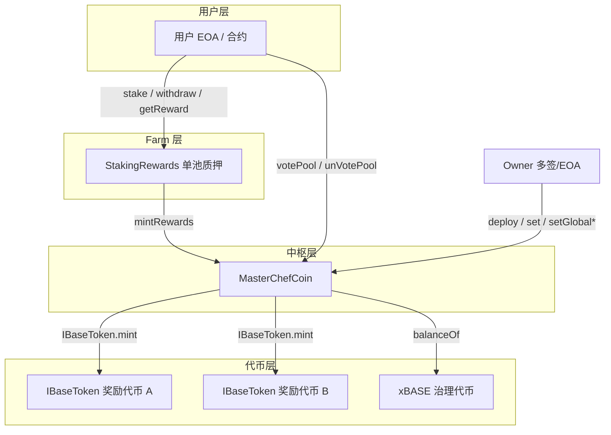
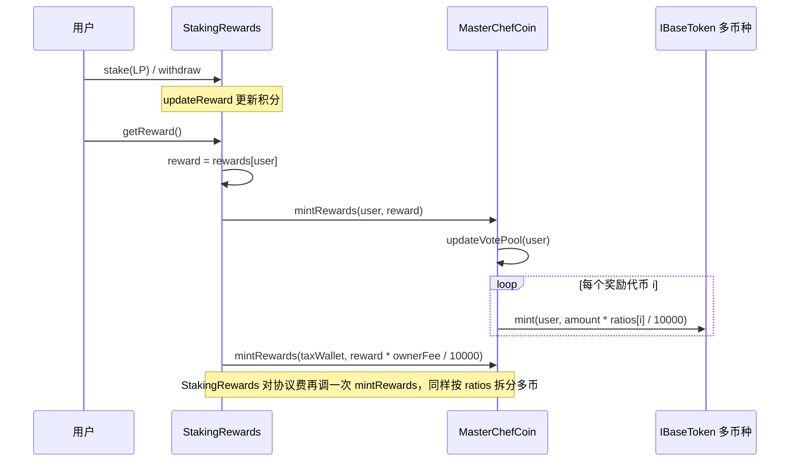
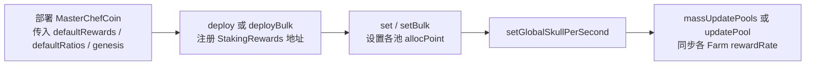

# MasterChefCoin 合约说明

本文档对应 `MasterChefCoin.sol`：说明其**代码架构**、**设计原理**、**核心交互流程**（含流程图），以及**核心状态变量与函数**的典型使用场景，并辅以**可落地的业务示例**。

---

## 一、合约定位与架构

### 1.1 一句话定位

`MasterChefCoin` 是 **V2 流动性挖矿体系的「铸币与调度中枢」**：已注册的 Farm 合约（`StakingRewards`）在用户领奖时调用 `mintRewards`，由本合约按池子配置的 **多代币 + 万分比（`ratios`）** 向用户（及协议金库）铸造奖励；同时通过 **`globalSkullPerSecond` / `allocPoint`** 驱动各 Farm 的 **`rewardRate`**，并叠加 **xBASE 治理投票**带来的 **社区排放份额（`allocPointCommunity`）**。

### 1.2 分层架构（谁依赖谁）



- **StakingRewards**：负责「质押量、奖励积分（`rewardPerToken`）」计算；**不持有预存奖励代币**，领奖时把 **奖励计量** `reward` 交给 `MasterChefCoin.mintRewards` 去拆成多币铸造。
- **MasterChefCoin**：维护 **Farm 白名单（`isFarm`）**、**每池多币奖励与比例**、**全局每秒产出与分配点**、**投票权与社区池权重**；是唯一被授权调用各 `IBaseToken.mint` 的入口之一（Farm 路径 + `minters` 白名单路径）。

### 1.3 与 `MasterchefV2` 的关系

本合约与仓库中的 `MasterchefV2` **同族**：均为 **MasterChef + StakingRewards** 模式。`MasterChefCoin` 在注释中说明在 V2 基础上增加了 **`minters` 映射**与 **`mintRewardsByAddress`**，允许经白名单的地址 **不经 Farm 的 `ratios` 拆分**，直接向指定 `IBaseToken` 铸币（例如活动空投、补偿、与合作方结算）。

---

## 二、设计原理

### 2.1 奖励计量 vs 真实代币：为何用「万分比拆分」

- Farm 内 `earned` / `rewards` 存的是 **抽象的奖励计量**（与 `rewardPerToken` 算法一致，单位与 `rewardRate` 配套）。
- 真实发放时，`mintRewards(_receiver, _amount)` 把 `_amount` 按该池 `rewards[i]` 与 `ratios[i]`（**万分比，总和通常 10000**）拆成多笔 `mint`。

**设计意图**：同一套池子可 **同时挖多种代币**（例如平台币 + 合作方代币），比例由治理调整，无需改 Farm 合约逻辑。

### 2.2 每秒产出：`globalSkullPerSecond` 与 `allocPoint`

- 对 `masterchefControlled == true` 的池，`_updatePool` 根据  
  `normalRewardRate = globalSkullPerSecond * pool.allocPoint / totalAllocPoint`  
  调用 `StakingRewards.setRewardRate`，使全链 **总每秒计量** 与全局配置一致。
- **可投票池（`isVoteable == true`）** 再叠加社区部分：  
  `communityRewardRate = globalCommunitySkullPerSecond * allocPointCommunity / totalAllocPointCommunity`，  
  `newRate = normalRewardRate + communityRewardRate`。

**设计意图**：**基础排放**由全局 + 池权重决定；**社区加成**由 xBASE 投票把 `allocPointCommunity` 分到各池，实现「治理引导流动性」而无需改合约。

### 2.3 投票与领奖同步：`updateVotePool`

用户调用 `mintRewards`（来自 Farm）前会执行 `updateVotePool(_receiver)`：若用户曾投票，则按其 **当前 `getTotalVotePower`** 刷新对 `votedID` 池的 `allocPointCommunity`，避免 **领了奖但投票权重已变** 时仍按旧权重分配社区排放。

### 2.4 安全边界

| 机制 | 说明 |
|------|------|
| `isFarm[msg.sender]` | 只有注册 Farm 可 `mintRewards`，防止任意地址伪造领奖。 |
| `stakingRewardsGenesis` | 到达该时间前禁止铸币，防止过早释放。 |
| `minters` + `mintRewardsByAddress` | 与 Farm 路径分离的额外铸币能力，由 `onlyOwner` 配置白名单。 |
| `killFarm` | 将 `isFarm` 置 false，并在 `_updatePool` 分支里把该池 `rewardRate` 置 0（若 `masterchefControlled`）。 |

---

## 三、核心交互流程图

### 3.1 用户挖矿与领奖（主路径）



**实例**：某池 `ratios = [7000, 3000]`，对应 `COIN` 与 `PARTNER`。用户待领计量 `reward = 1000`（任意单位一致即可）。

- 用户到账：`700` 单位的 `COIN` 计量、`300` 单位的 `PARTNER` 计量（具体精度由各自 `mint` 决定）。
- 若 `ownerFee = 200`（2%），Farm 再 `mintRewards(taxWallet, 20)`，税包同样按 70%/30% 拆成两种代币。

### 3.2 Owner 注册 Farm 并配置排放



**实例**：新上一池 ETH-USDC LP Farm：Owner `deploy(newFarmAddr, startTime, true)`，`set(pid, 100)`，再 `setGlobalSkullPerSecond(1e18)`，最后 `massUpdatePools()`，该池若占 `totalAllocPoint` 的 10%，则其 `rewardRate` 会被设为 `0.1 * 1e18`（在 `totalAllocPoint` 仅该池时数值关系会不同，以实际 `allocPoint` 求和为准）。

### 3.3 用户投票（社区排放）

```mermaid
flowchart TB
    V1[用户持有 xBASE 或单币质押算 vote power] --> V2{votePool(pid)}
    V2 -->|通过| V3[vote: 把全部 vote 投到 pid\n增加 allocPointCommunity]
    V4[unVotePool] --> V5[redeemVote: 收回社区权重]
```

**实例**：用户钱包有 `1000 xBASE`，某池开启 `isVoteable` 且 `countDepositAmountAsVotingPower` 为 false，则 `getTotalVotePower = 1000`。用户调用 `votePool(3)`，会把 `1000` 加到 `poolInfo[3].allocPointCommunity`（内部通过 `increaseAllocation`），从而拉高该池在 `globalCommunitySkullPerSecond` 下的分成。

### 3.4 白名单直铸（`mintRewardsByAddress`）

```mermaid
flowchart LR
    W[minters 地址] --> M[mintRewardsByAddress(receiver, amount, token)]
    M --> T[IBaseToken.mint\n不经过 ratios 拆分]
```

**实例**：运营活动需向某地址直接发 **100 COIN**，且不想走 Farm 比例拆分：Owner 事先 `setMinters(活动合约, true)`，活动合约调用 `mintRewardsByAddress(用户, 100, COIN地址)`。

---

## 四、核心变量说明（含场景示例）

| 变量 | 含义 | 使用场景示例 |
|------|------|----------------|
| `xBASE` | 治理代币地址 | 计算投票权：`getTotalVotePower` 读取用户钱包 xBASE 余额。 |
| `stakingRewardsGenesis` | 全局开始铸币时间 | 主网上线日设为 `T0`，此前所有 `mintRewards` 回滚，防止提前挖。 |
| `totalAllocPoint` | 全池基础分配点之和 | Owner 给三池分别 `allocPoint` 为 100、200、100，则总 400，某池基础速率 = `globalSkullPerSecond * 100/400`。 |
| `totalAllocPointCommunity` | 社区分配点之和 | 用户投票把「票数」加在各池 `allocPointCommunity` 上，与 `globalCommunitySkullPerSecond` 相乘除得到社区加成速率。 |
| `globalSkullPerSecond` | 全局基础每秒计量 | 项目方决定每日总排放后换算成 wei/秒写入，配合 `massUpdatePools` 生效。 |
| `globalCommunitySkullPerSecond` | 社区加成每秒计量 | 治理池独立一条排放曲线，只影响 `isVoteable` 且 `masterchefControlled` 的池。 |
| `defaultRewards` / `defaultRatios` | 新池默认多币与比例 | `deploy` 新 Farm 时自动拷贝；若某池要单独双币 50/50，Owner 调 `setTokensAndRatiosFarm(pid, ...)`。 |
| `poolInfo[]` | 每池元数据 | 存 Farm 地址、alloc、是否可投票、是否 Chef 控速、每池独立 `rewards`/`ratios`。 |
| `isFarm` | Farm 白名单 | `StakingRewards` 调用 `mintRewards` 时必须为 true；`killFarm` 置 false 并配合更新速率。 |
| `poolPidByStakingFarmAddress` | Farm → 池 ID | `mintRewards` 内 `msg.sender` 为 Farm 时查 pid，取对应 `ratios`/`rewards`。 |
| `userInfo` / `voted` | 用户投票状态 | `votePool` 记录 `votedID`；`unVotePool` 清除；`mintRewards` 前 `updateVotePool` 同步权重。 |
| `minters` | 直铸白名单 | 配合 `mintRewardsByAddress` 做活动发奖、跨合约结算。 |

---

## 五、核心函数说明（含场景示例）

### 5.1 部署与注册

| 函数 | 作用 | 示例 |
|------|------|------|
| `constructor` | 设置 xBASE、默认多币比例、genesis；部署者为首个 `minters` | 传入 `COIN`、`PARTNER` 两地址，`ratios=[5000,5000]`，`genesis` 为 TGE 后一小时。 |
| `deploy` / `deployBulk` | 注册已部署的 `StakingRewards` | 工厂先部署 5 个 Farm，Owner 一次 `deployBulk` 五个地址与各自 `start`。 |
| `deployWithCreation` | 本合约内 `new StakingRewards` 并注册 | 快速上新池 LP，且 `masterchefControlled=true`、`isVoteable=true`。 |

### 5.2 铸币

| 函数 | 作用 | 示例 |
|------|------|------|
| `mintRewards` | Farm 专用；按池 `ratios` 拆 `_amount` 多币 `mint` | 仅 `StakingRewards.getReward` 应调用；用户收到多代币奖励。 |
| `mintRewardsByAddress` | `minters` 直铸单币，不拆比例 | 空投合约被加入 `minters` 后给用户发单一 COIN。 |

### 5.3 排放与池更新

| 函数 | 作用 | 示例 |
|------|------|------|
| `set` / `setBulk` | 修改池 `allocPoint` | 治理决议提高 WETH 池权重，Owner `set(pid, 500)`。 |
| `setGlobalSkullPerSecond` / `setGlobalCommunitySkullPerSecond` | 修改全局每秒计量 | 减半排放：把 `globalSkullPerSecond` 从 `2e17` 改为 `1e17` 后再 `massUpdatePools`。 |
| `massUpdatePools` / `updatePool` | 遍历或单池 `_updatePool`，同步 `setRewardRate` | 改完全局变量后必须调用，否则 Farm 仍用旧 `rewardRate`。 |

### 5.4 投票

| 函数 | 作用 | 示例 |
|------|------|------|
| `getTotalVotePower` | xBASE 余额 + 可选单币质押余额 | 某池 `countDepositAmountAsVotingPower=true` 时，用户在该 Farm 的 `balanceOf` 计入总票。 |
| `votePool` / `unVotePool` | 投票 / 撤票 | 用户把全部票投给「USDC 池」以增加其 `allocPointCommunity`。 |

### 5.5 管理与风控

| 函数 | 作用 | 示例 |
|------|------|------|
| `setTokensAndRatiosFarm` | 单池改多币与比例 | 合作结束：某池从双币改为只发 COIN，`rewards=[COIN]`，`ratios=[10000]`。 |
| `setDefaultTokensAndRatios` | 修改**之后**新池的默认值 | 全局从双币改为三币，新 `deploy` 的池默认三币比例。 |
| `killFarm` / `activateFarm` | 关闭或恢复 Farm | 漏洞池紧急 `killFarm`，`isFarm=false` 且更新速率；修复后 `activateFarm`。 |
| `setMinters` | 增删直铸白名单 | 新活动合约上线前 `setMinters(合约, true)`。 |
| `pullExtraTokens` | Owner 转出任意 ERC20 | 误转入的代币 rescue（**注意**：正常奖励是 `mint` 不是转入，此函数用于处理误操作）。 |

---

## 六、依赖与接口

- **`IBaseToken`**：`mint(address, uint256) returns (bool)` — 所有 `rewards` 与 `mintRewardsByAddress` 的目标代币须实现。
- **`ISingleStaking`**：`balanceOf` — 用于投票权统计（单币质押类 Farm）。
- **`IStakingRewards`**（定义于 `StakingRewards.sol`）：`rewardRate`、`setRewardRate` — 供 `_updatePool` 同步排放。
- **`StakingRewards`**：构造时传入的 `masterChef` 须为本合约地址；`getReward` 内调用 `IMasterChef.mintRewards`。

---

## 七、集成检查清单（落地前建议）

1. **genesis**：`stakingRewardsGenesis >= block.timestamp`（构造函数已校验）；各 Farm `_farmStartTime > stakingRewardsGenesis`。
2. **比例**：`rewards.length == ratios.length`，且万分比之和与代币经济模型一致（避免舍入导致长期偏差）。
3. **权限**：`StakingRewards` 的 `masterChef` 指向本合约；升级 Chef 时用 Farm 的 `setMasterChef`（需 `taxWallet` 权限）。
4. **改全局速率后**：执行 `massUpdatePools()`，否则各池 `rewardRate` 滞后。
5. **`minters`**：最小权限原则，仅授予可信合约或多签。

---

*文档版本与合约 `MasterChefCoin.sol` 源码一致；若合约变更，请同步更新本 README。*
